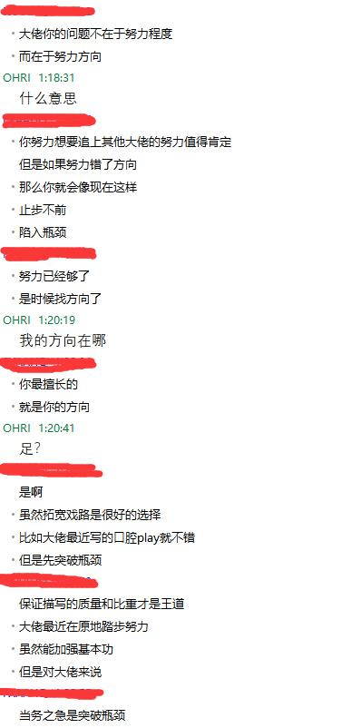
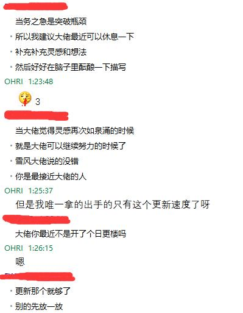

# 问个小问题

作者：咸の一批

TID：25634

<title>1</title> <link href="../Styles/Style.css" type="text/css" rel="stylesheet">

# 1

我的文章特色到底是什么……不是说好在哪里，而是说，我的文章让你能想到什么，这样的感觉，如果我找到这种感觉进行努力，我说不定能突破这个瓶颈期，给大家献上更好的文章

就是比如说我很多文章对足的描写都很多，这样的问题

<ignore_js_op>

**QQ截图20180805013011.jpg** *(33.62 KB, 下載次數: 0)*

[下載附件](forum.php?mod=attachment&aid=NzM1MTR8NWNkZDQ4MDd8MTY3NDA2NzAzOXwxODIzMHwyNTYzNA%3D%3D&nothumb=yes)

2018-8-5 01:31 上傳

<ignore_js_op>

**QQ截图20180805013124.jpg** *(24.11 KB, 下載次數: 0)*

[下載附件](forum.php?mod=attachment&aid=NzM1MTV8MzU4YWQ3ZmN8MTY3NDA2NzAzOXwxODIzMHwyNTYzNA%3D%3D&nothumb=yes)

2018-8-5 01:31 上傳

当事人要脸，所以匿了他的QQ
<title>2</title> <link href="../Styles/Style.css" type="text/css" rel="stylesheet">

# 2

可以多一點對女主身材的細節描述 會讓人看的更心癢癢 足部很好 但希望可以看到其他冷門部位 例如鎖骨 口鼻 肚臍 <title>3</title> <link href="../Styles/Style.css" type="text/css" rel="stylesheet">

# 3

感覺是個有點沉重的話題呢......

樓主給我的感覺是更新速度奇快，質量也挺好的，讓我有點難以想像呢！

我自己在寫的時候一定要先完成大鋼才能寫成文章，而且寫完後常常需要反覆看好幾次，才能把自己邏輯不通順與敘述奇怪的地方修改完畢。幾小時就有幾千字什麼的對我來說根本不可能呀！因此非常羨慕樓主這種文章快速創作的能力。

或許對樓主您來說，只是缺乏靈感而已，那篇日更練筆的串就相當不錯，可以強迫自己去寫不擅長的題材。同時，也因為樓主對我提的點子回覆，讓我又學習到不同的敘述方式。若樓主能嘗試著與其他論壇大佬寫相同的題材，再觀察大佬與自己創作的差異，必能收穫滿滿。

回歸正題，樓主的文章除了更新速度奇快以外，還會讓我想到什麼呢？從我角度來看是：

1\. ......... 這種點點點的符號用的相當隨意沒有規律 (這是第一印象)

2\. 文章資訊量很大，各種尺寸、體型差、狀態的描寫非常多，這部分有時候會讓我看的時候感到疲倦，不過感受這部分描述的也很豐富，讓我容易理解與融入劇情，相當不錯。

3.常常有虐待情節，或者說明顯的SM情節，雖然不吸引我，但應該有一定市場，也不成問題

4.少有H情節，不會動不動就入陰入肛之類的，或許這點對喜歡看爽文的人來說是缺點吧，但對我來說是優點

5.有幾個固定的套路：
套路A：男主角出現弱勢或遇到麻煩→女主角大顯神威解決問題→進入(巨大)女超人情節
套路B：男主角想要強勢→女主角變大或男主角縮小→進入SM情節
(可能還有其他，只是我還沒看完高產的樓主全部文章)

但GTS的文章除了突然放大縮小之外，常常看來看去就是這些套路，我覺得需要一點新東西，像之前的口腔洗澡就蠻新鮮的。此外，日更那篇有不少新鮮的題材，樓主也寫得不錯！

6.足部(腳趾)play描寫特別擅長，不過還是希望能多往其他方向發展。

對於"樓主擅長的方向"是什麼呢？你給的QQ貼圖回覆是 "足"，但我認為是"武俠奇幻小說"

我覺得對於作者而言，擅長的方向應該是某一種文章類型，也是創作風格，從你的作品來看：
《全知全能的青梅竹马》《仿佛被约定俗成的世界》
《剑灵》《魁拔》
《作为玉藻前宠物的生活》
《不一样的修仙日常》
《新生》
《自认为是妻管严的皇帝的日常》
《被自己的角色调教的日子》
《“兄弟”》
上面的作品中，我覺得除了《新生》的風格跳脫得比較遠之外，幾乎所有文章的角色都有一些"技能"，如同武俠小說般每位主角各有武功，世界觀則是與我們日常生活所在的世界差異不會太大。

或許是樓主之前接觸這類作品相當多，才會有這種特色吧？我覺得寫作風格繼續朝這個方向前進即可，劇情方面則可多加一些"勢力對抗"的背景設定，讓整個故事存在一個鮮明的"主線任務"，或是留一些劇情表明下一回才會揭曉結果，使章節之間的連結更強一點，也更能激起讀者期待下一回劇情的感受。

<title>4</title> <link href="../Styles/Style.css" type="text/css" rel="stylesheet">

# 4

我能说是“过漆袜”吗？（不正经回复）每到福利时看到大脑总会出戏 

<title>5</title> <link href="../Styles/Style.css" type="text/css" rel="stylesheet">

# 5

来歪个楼，请问楼主构思角色的时候是怎么一个过程呀 <title>6</title> <link href="../Styles/Style.css" type="text/css" rel="stylesheet">

# 6

> [蕩漾 發表於 2018-8-6 20:38](https://giantessnight.cf/gnforum2012/forum.php?mod=redirect&goto=findpost&pid=383841&ptid=25634)
> 来歪个楼，请问楼主构思角色的时候是怎么一个过程呀

先想象一下角色的性格特点之类的，然后开始构思这个角色面对各种情况时的反应，大概就是自我扮演和催眠那种感觉

现在脑子里有好多角色…………每次写文都要精分
<title>7</title> <link href="../Styles/Style.css" type="text/css" rel="stylesheet">

# 7

满脑子都是足的我...只能说足部描写比较斯巴拉西（当然这不是再说我很变态） <title>8</title> <link href="../Styles/Style.css" type="text/css" rel="stylesheet">

# 8

足控文残忍系还有最近新展开的一些新paly都很好，不过我口味儿越来越重了，光看足解决不了生理问题了，所以大佬的文只是粗略翻一翻，个人感觉您还是挺高产用心的一个人了。</ignore_js_op></ignore_js_op>