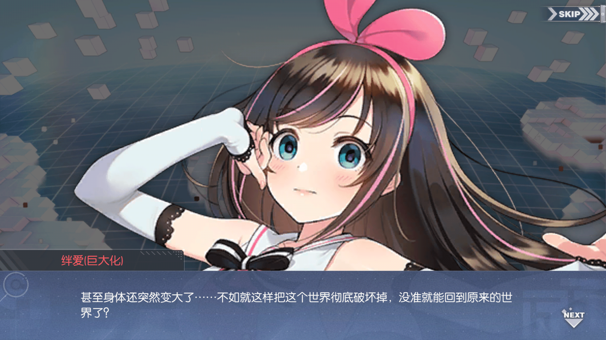
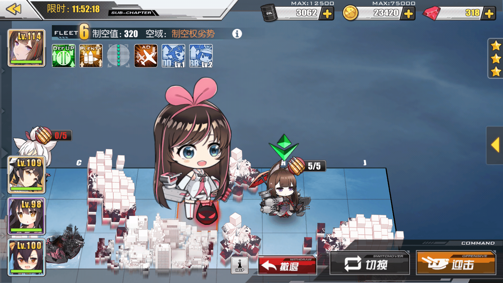
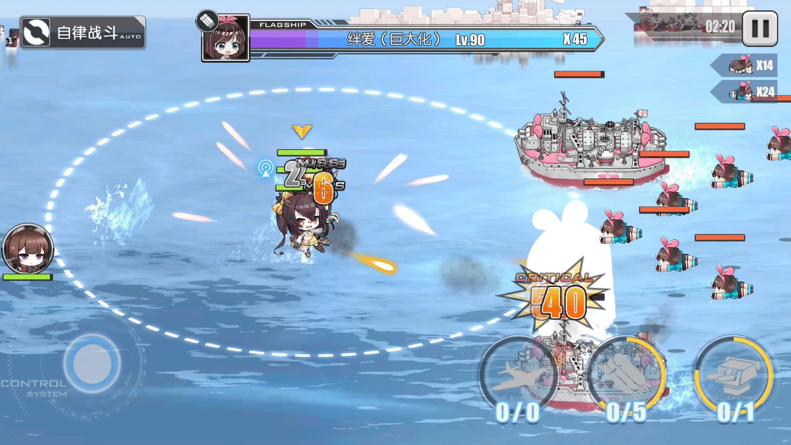
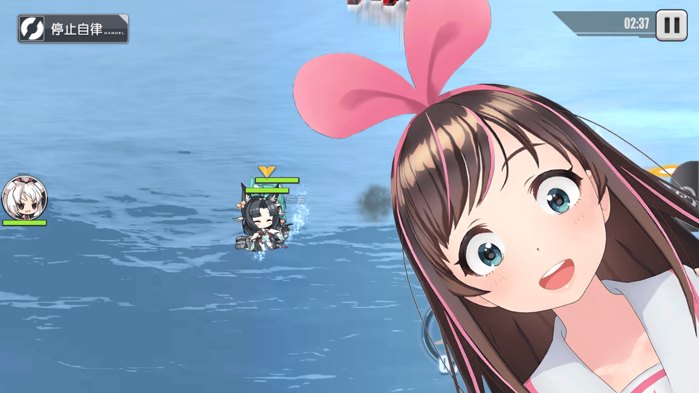

# 问是哪个视频的？

作者：田棒棒

TID：26786

<title>1</title> <link href="../Styles/Style.css" type="text/css" rel="stylesheet">

# 1

然而这是碧蓝航线的游戏截图 <title>2</title> <link href="../Styles/Style.css" type="text/css" rel="stylesheet">

# 2

*本帖最後由 紫色欧石楠 於 2019-4-27 23:16 編輯*

爱酱和碧蓝航线的联动，第四关（最终）的BOSS形态。。。但是吧也就立绘变大了，以及游戏里变大了并没有啥互动（应该是官方很好地玩了之前的视频梗吧，比如第三关吃鸡，第二关live，还有提到自己的衣服其实是投影（因为这个捏他还被油管封杀过。。）总之比起前两次联动这次瓜游的文案可算有点长进了）这是剧情截图
<ignore_js_op>

**Screenshot_2019-04-27-22-59-18-839_com.bilibili.azurlane.png** *(1.63 MB, 下載次數: 1)*

[下載附件](forum.php?mod=attachment&aid=Nzc5MzF8YTJmY2YwNjR8MTY3NDA2ODY2OHwxODIzMHwyNjc4Ng%3D%3D&nothumb=yes)

剧情

2019-4-27 23:09 上傳

这是攻略画面大地图的样子。。确实很巨大。。但是实际进游戏里并没有很大。。
<ignore_js_op>

**Screenshot_2019-04-27-22-55-35-485_com.bilibili.azurlane.png** *(1.44 MB, 下載次數: 0)*

[下載附件](forum.php?mod=attachment&aid=Nzc5MzN8MDAzNTI5Mjl8MTY3NDA2ODY2OHwxODIzMHwyNjc4Ng%3D%3D&nothumb=yes)

2019-4-27 23:13 上傳

<ignore_js_op>

**Screenshot_2019-04-27-22-57-39-049_com.bilibili.azurlane.png** *(1.5 MB, 下載次數: 0)*

[下載附件](forum.php?mod=attachment&aid=Nzc5MzJ8MjA5ZDUyNDJ8MTY3NDA2ODY2OHwxODIzMHwyNjc4Ng%3D%3D&nothumb=yes)

2019-4-27 23:11 上傳

PS，私以为这个其实更好玩： <ignore_js_op>

**Screenshot_2019-04-26-15-40-10-005_com.bilibili.azurlane.png** *(1.31 MB, 下載次數: 0)*

[下載附件](forum.php?mod=attachment&aid=Nzc5MzR8ZjQwMzU4YjV8MTY3NDA2ODY2OHwxODIzMHwyNjc4Ng%3D%3D&nothumb=yes)

2019-4-27 23:15 上傳

<title>3</title> <link href="../Styles/Style.css" type="text/css" rel="stylesheet">

# 3

唉&……看到这个我就担心这个池子我能不能毕业…… <title>4</title> <link href="../Styles/Style.css" type="text/css" rel="stylesheet">

# 4

好像在b站见过的样子。。。
<title>5</title> <link href="../Styles/Style.css" type="text/css" rel="stylesheet">

# 5

B战有吗？现在去看看~~~~~</ignore_js_op></ignore_js_op></ignore_js_op></ignore_js_op>