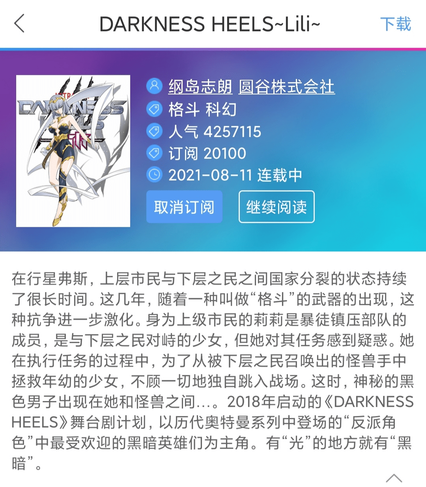

# 问是哪部漫画的找到的？

作者：田棒棒

TID：31494

<title>1</title> <link href="../Styles/Style.css" type="text/css" rel="stylesheet">

# 1

Darkness Heels （黑暗邪雄）
是奥特圈的漫画，主要内容是讲某星人将奥特中一些比较出名但是立场偏向邪恶守序／邪恶中立的角色复活
然后限制力量防止控制不住什么的。（人物例如：贝利亚，卡密拉，邪迪什么什么的）
虽然也有看奥特的爱好但是这篇漫画没怎么看，听说一些情报是有人物能变成图里面的那样人类外形的奥（虽然大多数都是正常奥什么的……）
嘛，如果不是很雷正常奥的话可以去看看……没看过也不敢说推不推荐了…… <title>2</title> <link href="../Styles/Style.css" type="text/css" rel="stylesheet">

# 2

*本帖最後由 lwp 於 2021-8-18 09:58 編輯*

微博光之国汉化组有在汉化哦，女奥亚种了属于是，里面也有卡密拉出场，人类形态是漂亮小姐姐，（卡密拉，嘿嘿，我的卡密拉）
这部漫画是同名舞台剧的延伸作，看名字就知道是以原作里面的反派们为主角的，光和黑暗只是一种力量，要看所有者本身如何使用。女主莉莉使用的手镯可以使人超人化，但巨大化会损耗寿命。莉莉目前只在第一话巨大化了一页然后立即吃瘪被贝利亚救了，最新一话里要和奥特曼形态的贝利亚打架。漫画作者也是老奥迷了，里面也有不少奥特曼梗，还画了主角莉莉被红超人欺负然后被卡密拉救了的小漫画。里面有卡密拉巨大化破坏斗技场的剧情，gts元素不能说没有，但约于0，奥迷可以看看，冲着gts去的就别想了。
<title>3</title> <link href="../Styles/Style.css" type="text/css" rel="stylesheet">

# 3

 <ignore_js_op>[IMG_20210818_092521.jpg](forum.php?mod=attachment&aid=OTAzODR8ZWI4NGQ4YmN8MTY3NDA2ODQ1MHwxODIzMHwzMTQ5NA%3D%3D&nothumb=yes) *(381.66 KB, 下載次數: 0)*

[下載附件](forum.php?mod=attachment&aid=OTAzODR8ZWI4NGQ4YmN8MTY3NDA2ODQ1MHwxODIzMHwzMTQ5NA%3D%3D&nothumb=yes)

2021-8-18 09:25 上傳  

动漫之家就可以看

</ignore_js_op> <title>4</title> <link href="../Styles/Style.css" type="text/css" rel="stylesheet">

# 4

这不是那个舞台剧改编的漫画吗？随便找找就找到了，比起来主角我一直在等煎饺星人，他出来了感觉能更有意思，也不知道等着老托会不会出来