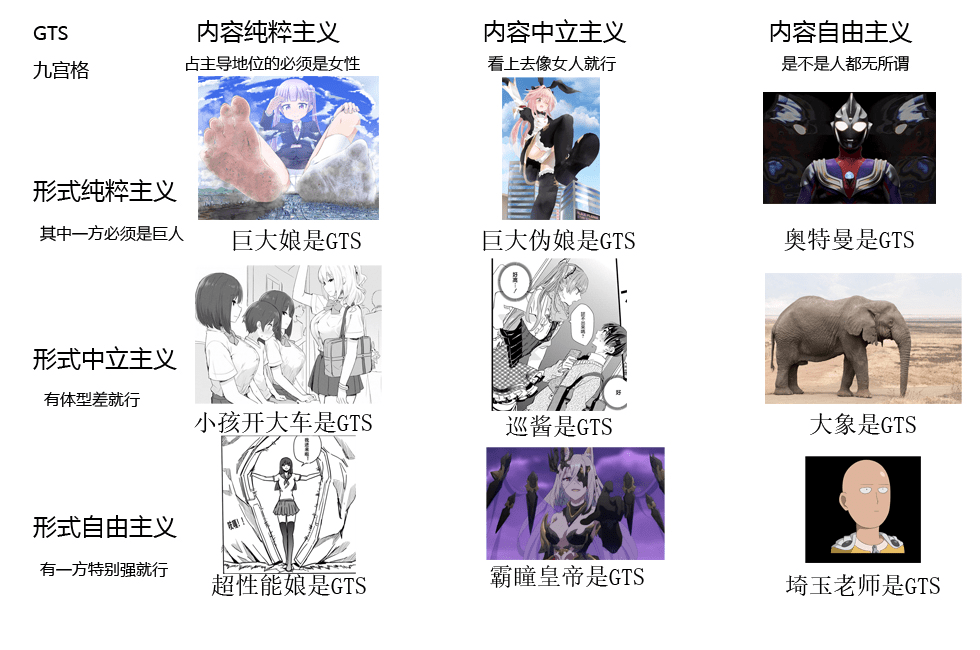

# 闲着无聊用最近很火的九宫格梗做了一个GTS九宫格

作者：xxx1137727897

TID：29006

<title>1</title> <link href="../Styles/Style.css" type="text/css" rel="stylesheet">

# 1

不知道还有啥地方可以修改的 <ignore_js_op>

**gts9.jpg** *(284.71 KB, 下載次數: 3)*

[下載附件](forum.php?mod=attachment&aid=ODM3NDJ8ZTZkNTBhNDB8MTY3NDA2NjQxM3wxODIzMHwyOTAwNg%3D%3D&nothumb=yes)

2020-7-3 17:59 上傳

<title>2</title> <link href="../Styles/Style.css" type="text/css" rel="stylesheet">

# 2

*本帖最後由 神父桑 於 2020-7-3 18:54 編輯*

第三列明显是gt啊。。。或者巨兽furry，反正那应该算不上GTS的范畴了吧 还不如把哥斯拉是gts也加上去
<title>3</title> <link href="../Styles/Style.css" type="text/css" rel="stylesheet">

# 3

奥特曼笑死我了 <title>4</title> <link href="../Styles/Style.css" type="text/css" rel="stylesheet">

# 4

巡酱是什么？正中间的那个 <title>5</title> <link href="../Styles/Style.css" type="text/css" rel="stylesheet">

# 5

这么一看，我是内容纯粹，形式中立派的 <title>6</title> <link href="../Styles/Style.css" type="text/css" rel="stylesheet">

# 6

这个九宫格可以说是很优秀了，琦玉大象奥特曼。。。
<title>7</title> <link href="../Styles/Style.css" type="text/css" rel="stylesheet">

# 7

> [xxx1137727897 發表於 2020-7-3 16:33](https://giantessnight.cf/gnforum2012/forum.php?mod=redirect&goto=findpost&pid=440928&ptid=29006)
> 巡酱是什么？正中间的那个

是我很喜欢的一部漫画的主角，高个子伪娘
<title>8</title> <link href="../Styles/Style.css" type="text/css" rel="stylesheet">

# 8

祝你10连必出彩

作图辛苦了 <title>9</title> <link href="../Styles/Style.css" type="text/css" rel="stylesheet">

# 9

你是不是在暗示我琦玉老师不是人 <title>10</title> <link href="../Styles/Style.css" type="text/css" rel="stylesheet">

# 10

> [TANGLUNG 發表於 2020-7-4 02:43](https://giantessnight.cf/gnforum2012/forum.php?mod=redirect&goto=findpost&pid=440947&ptid=29006)
> 是我很喜欢的一部漫画的主角，高个子伪娘

什么漫画？我看画风不错唉，也想看看
<title>11</title> <link href="../Styles/Style.css" type="text/css" rel="stylesheet">

# 11

看到琦玉老师后没忍住笑了</ignore_js_op>