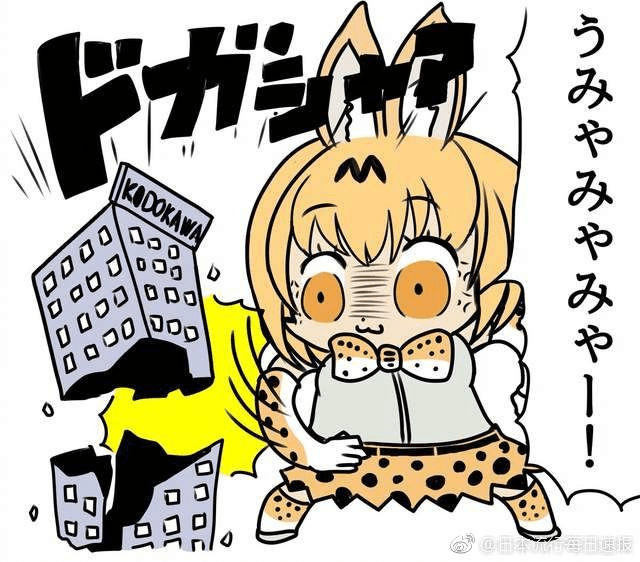

# 随便翻到的擦边吧

作者：田棒棒

TID：26041

<title>1</title> <link href="../Styles/Style.css" type="text/css" rel="stylesheet">

# 1

這張圖變形很多呢 像是動物朋友與角川 <title>2</title> <link href="../Styles/Style.css" type="text/css" rel="stylesheet">

# 2

> [田棒棒 發表於 2018-11-6 07:08](https://giantessnight.cf/gnforum2012/forum.php?mod=redirect&goto=findpost&pid=390549&ptid=26041)
> 本来就是q版而且简笔的画风

不 我說的變形不是指那個
<ignore_js_op>

**150642168140.jpg** *(83.96 KB, 下載次數: 0)*

[下載附件](forum.php?mod=attachment&aid=NzUzNTd8YmIzMDEzNmN8MTY3NDA2NjkwM3wxODIzMHwyNjA0MQ%3D%3D&nothumb=yes)

2018-11-6 11:23 上傳

<title>3</title> <link href="../Styles/Style.css" type="text/css" rel="stylesheet">

# 3

> [田棒棒 發表於 2018-11-6 18:25](https://giantessnight.cf/gnforum2012/forum.php?mod=redirect&goto=findpost&pid=390577&ptid=26041)
> 因为考虑版权问题吧，分析哪个动漫人物时，插画故意画的像又不像

但是画的不像给人感觉就很别扭，为什么不直接自己画个人物呢
<title>4</title> <link href="../Styles/Style.css" type="text/css" rel="stylesheet">

# 4

> [田棒棒 發表於 2018-11-13 21:46](https://giantessnight.cf/gnforum2012/forum.php?mod=redirect&goto=findpost&pid=390903&ptid=26041)
> 原创要另外费脑力，就先借鉴然后稍微分析吧

不是的，这种其实就是属于玩梗的范畴……就好像一张表情被P成各种不同的人物那样的，相当于同时玩多个梗（一时找不到例子，说得比较模糊）
pop team epic的本社爆破本来就是一个梗了，所以会用改图的方式来玩梗
<title>5</title> <link href="../Styles/Style.css" type="text/css" rel="stylesheet">

# 5

恩......好像有點太擦邊了呢.....</ignore_js_op>