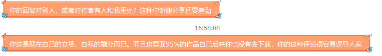

# 隔壁评论预览发生的事情

作者：wwwnwy

TID：25573

<title>1</title> <link href="../Styles/Style.css" type="text/css" rel="stylesheet">

# 1

在隔壁呆了几年,一直没有做过什么贡献,也是抱歉,然后就看看新帖的预览,发表一下个人的意见.然后被那里的大佬抓住:见图片
我去问了问:你发了那么多意图只是刷积分,而且你回复那么多很多帖子都没买,这样容易误导别人!
但是我想了想:我依靠回复赚取积分很正常啊,而且我是认真看过预览的并且是一大串剧情简介都看得那种,我认真看认真读,然后发表个人看法,赚取积分我觉得很合法啊...毕竟差异就在预览,如果模板的话我完全可以说感谢×××分享×××,这多方便,还何必去看预览和文字...          但是隔壁的大佬并不这么想,所以我想看看各位的看法               
    不过我也要说明,隔壁的大佬对新人挺好的,梯子,P图,压片全都会并且可以细心的教给你让你学会,而且那里毕竟是专注分享的地方,我这种没有转过几个自愿的在隔壁是很惭愧.这可能只是观念的一些冲突,但是总体我还是挺敬重那个大佬的,毕竟那一个站就靠他一个人撑着,前段被攻击他修了好久的...
<title>2</title> <link href="../Styles/Style.css" type="text/css" rel="stylesheet">

# 2

 <ignore_js_op>[2018-07-22_030835.jpg](forum.php?mod=attachment&aid=NzMzNTl8YjA1ODc4N2Z8MTY3NDA2NzA0MXwxODIzMHwyNTU3Mw%3D%3D&nothumb=yes) *(35.22 KB, 下載次數: 9)*

[下載附件](forum.php?mod=attachment&aid=NzMzNTl8YjA1ODc4N2Z8MTY3NDA2NzA0MXwxODIzMHwyNTU3Mw%3D%3D&nothumb=yes)

2018-7-22 03:09 上傳  

</ignore_js_op> <title>3</title> <link href="../Styles/Style.css" type="text/css" rel="stylesheet">

# 3

事已至此我也不想掐架啊什么的,就是想看看各位的看法而已,毕竟我在隔壁的帐号已经被清空,积分什么的全空了,这些是争不回来的...唉... <title>4</title> <link href="../Styles/Style.css" type="text/css" rel="stylesheet">

# 4

隔壁怎么说呢，有点资本化，他们拿来购买资源的金钱还有积分搞得和个小社会一样。而且自打隔壁巨大男资源天天占首页后就不怎么去了 <title>5</title> <link href="../Styles/Style.css" type="text/css" rel="stylesheet">

# 5

可不是细心，是指着你充钱买资源呢
看你不充钱，说删积分就删，生怕你白嫖了让他少一块肉
小气的很

<title>6</title> <link href="../Styles/Style.css" type="text/css" rel="stylesheet">

# 6

可不是细心，是指着你充钱买资源呢
看你不充钱，说删积分就删，生怕你白嫖了让他少一块肉
小气的很

<title>7</title> <link href="../Styles/Style.css" type="text/css" rel="stylesheet">

# 7

> [titiwong 發表於 2018-7-22 09:26](https://giantessnight.cf/gnforum2012/forum.php?mod=redirect&goto=findpost&pid=382644&ptid=25573)
> 隔壁怎么说呢，有点资本化，他们拿来购买资源的金钱还有积分搞得和个小社会一样。而且自打隔壁巨大男资源天 ...

这个本人倒不是很介意，毕竟隔壁一个人操盘，服务器啥的也都是自己掏钱，买点就当捐助了.至于巨大男,当没看见就好,毕竟也是GTS的分支...
<title>8</title> <link href="../Styles/Style.css" type="text/css" rel="stylesheet">

# 8

> [key 發表於 2018-7-22 10:36](https://giantessnight.cf/gnforum2012/forum.php?mod=redirect&goto=findpost&pid=382650&ptid=25573)
> 可不是细心，是指着你充钱买资源呢
> 看你不充钱，说删积分就删，生怕你白嫖了让他少一块肉
> 小气的很

这个应该不是冲钱的问题...你知道之前充值算积分的,然后某次更新吧冲钱获得的积分全部去掉了...我积分从1200多跌到500多,这是第一次我的积分遭受重创.
<title>9</title> <link href="../Styles/Style.css" type="text/css" rel="stylesheet">

# 9

反正我没冲过1分钱，买得起就买，买不起就不会冲钱。。。随缘吧 <title>10</title> <link href="../Styles/Style.css" type="text/css" rel="stylesheet">

# 10

怎么说呢。。隔壁就是资源分享站啦。。。真的打算花钱的话不如去购买作品去分享来获得金币比较合算哦 <title>11</title> <link href="../Styles/Style.css" type="text/css" rel="stylesheet">

# 11

我是直接举报给公安了 <title>12</title> <link href="../Styles/Style.css" type="text/css" rel="stylesheet">

# 12

其实为了论坛的活跃性这样做确实对于论坛来说有好处 但是换个角度来说 比较资本 人就没有GN好了 <title>13</title> <link href="../Styles/Style.css" type="text/css" rel="stylesheet">

# 13

*本帖最後由 摸鱼摸鱼 於 2018-7-22 16:31 編輯*

如果真的能让你完全靠回复赚取足够买资源的金币 就像隔壁很早期的样子一样 那慢慢除了他或者像sillybat大大那样无私发资源的 别人就不会有积极性去发了 都会想反正我随便回复回复就有金币了 那我多刷点回复什么资源都到手的 但是你刷的回复实际对论坛或者说对发资源的人的作用在哪呢 基本等于伸手党说句谢谢一样 你确实加入了你的看法 但在他发完资源之后看见了还是没有任何意义 也没有可以得到什么改进之类的建议 诚然 有的人会因为你的回复觉得开心 觉得有人在关注自己 或者自己帮到了人觉得很好 有的人就觉得这样你还不如别回复我了 还浪费我时间看你这句回复 看完了就完了 没作用 是吧 隔壁既然是有偿分享 那本意应该是搭建一个大家可以公平交易的平台 你用相等代价的东西来换取资源 充钱给站长 也是站长因为有自己的付出在里面 我觉得也没什么毛病 付出是需要回报的  而这边不同 这边就完全是靠爱好 靠着你对这件事情的热爱  顶多就是你发到了一定量的资源 能够有积分 有更加高的权限去获得一些 别人为了不想让萌新一进来什么都不付出就获得的资源 两边运营的模式是不一样的 我自己是觉得这边更加感性化 而那边更加商业化一点 两个模式也没有好坏之分 <title>14</title> <link href="../Styles/Style.css" type="text/css" rel="stylesheet">

# 14

> [hubert 發表於 2018-7-22 14:26](https://giantessnight.cf/gnforum2012/forum.php?mod=redirect&goto=findpost&pid=382670&ptid=25573)
> 我是直接举报给公安了

话说上次那个站关停，你弄的？
<title>15</title> <link href="../Styles/Style.css" type="text/css" rel="stylesheet">

# 15

> [763604064 發表於 2018-7-22 11:03](https://giantessnight.cf/gnforum2012/forum.php?mod=redirect&goto=findpost&pid=382658&ptid=25573)
> 反正我没冲过1分钱，买得起就买，买不起就不会冲钱。。。随缘吧

这个很难...毕竟很多人只下载的,也很少有人做汉化,大部分都是入不敷出的那种...
<title>16</title> <link href="../Styles/Style.css" type="text/css" rel="stylesheet">

# 16

> [wwwnwy 發表於 2018-7-22 14:52](https://giantessnight.cf/gnforum2012/forum.php?mod=redirect&goto=findpost&pid=382672&ptid=25573)
> 其实为了论坛的活跃性这样做确实对于论坛来说有好处 但是换个角度来说 比较资本 人就没有GN好了 ...

回复都没有了...怎么活跃...
<title>17</title> <link href="../Styles/Style.css" type="text/css" rel="stylesheet">

# 17

> [摸鱼摸鱼 發表於 2018-7-22 16:27](https://giantessnight.cf/gnforum2012/forum.php?mod=redirect&goto=findpost&pid=382684&ptid=25573)
> 如果真的能让你完全靠回复赚取足够买资源的金币 就像隔壁很早期的样子一样 那慢慢除了他或者像sillybat大大 ...

但是那个大佬我感觉完全是一人之建,他把我悉心经营了几年的帐号清零了!前几年刚进去靠着冲了几个钱混上积分,然后他把充值加的积分去了,我几分跌了一半,这是第一次我积分巨大变动!第二次是是把回复加的积分减少了,然后普我积分又跌了一半!这次因为这个回复直接给我清零了!   我这心里真的是.....
<title>18</title> <link href="../Styles/Style.css" type="text/css" rel="stylesheet">

# 18

> [4945 發表於 2018-7-22 23:56](https://giantessnight.cf/gnforum2012/forum.php?mod=redirect&goto=findpost&pid=382716&ptid=25573)
> 话说上次那个站关停，你弄的？

不是。不过，等那天心情不好时稿他一下。反正呢，我不会花钱给这种人赚。了不起自己买。他不就是一个二手中介商。没有任何实质性的作品
<title>19</title> <link href="../Styles/Style.css" type="text/css" rel="stylesheet">

# 19

> [hubert 發表於 2018-7-23 12:44](https://giantessnight.cf/gnforum2012/forum.php?mod=redirect&goto=findpost&pid=382754&ptid=25573)
> 不是。不过，等那天心情不好时稿他一下。反正呢，我不会花钱给这种人赚。了不起自己买。他不就是一个二手 ...

我只能说,中间商虽然真的是让人...但是你应该知道没有中间商是万万不能的.
<title>20</title> <link href="../Styles/Style.css" type="text/css" rel="stylesheet">

# 20

是啊，冲了金币不行，还要vip，有点过分