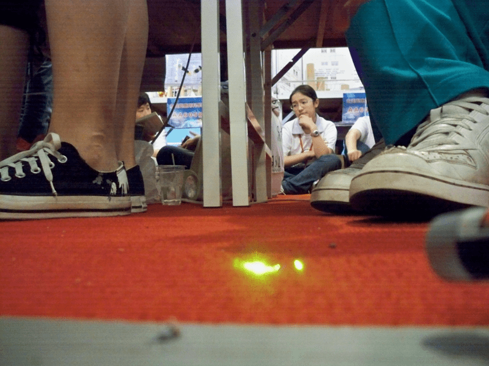
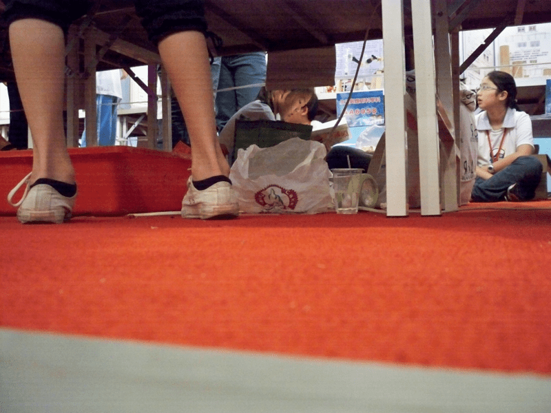
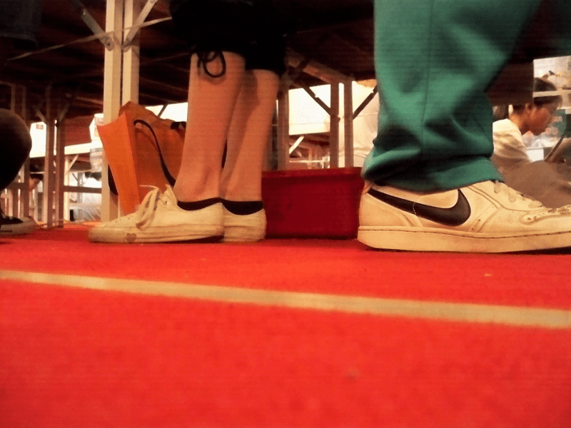

# 隨便拍拍

作者：g910414

TID：7788

<title>1</title> <link href="../Styles/Style.css" type="text/css" rel="stylesheet">

# 1

小弟最近在展場上拍得

畫質可能有點不太好，敬請見諒.....

<ignore_js_op>

**100_3481.jpg** *(333.61 KB, 下載次數: 0)*

[下載附件](forum.php?mod=attachment&aid=MjAyMTF8OTk2ZDNjZjB8MTY3NDA3MDQwM3wxODIzMHw3Nzg4&nothumb=yes)

2010-5-7 23:06 上傳

<ignore_js_op>

**100_3483.jpg** *(332.74 KB, 下載次數: 0)*

[下載附件](forum.php?mod=attachment&aid=MjAyMTJ8ZDk5Y2U0MmN8MTY3NDA3MDQwM3wxODIzMHw3Nzg4&nothumb=yes)

2010-5-7 23:06 上傳

<ignore_js_op>

**100_3489.jpg** *(284.34 KB, 下載次數: 0)*

[下載附件](forum.php?mod=attachment&aid=MjAyMTN8NTVlNjZjMDh8MTY3NDA3MDQwM3wxODIzMHw3Nzg4&nothumb=yes)

2010-5-7 23:06 上傳

<ignore_js_op>

**100_3494.jpg** *(305.54 KB, 下載次數: 0)*

[下載附件](forum.php?mod=attachment&aid=MjAyMTR8NzlmYjc3MWR8MTY3NDA3MDQwM3wxODIzMHw3Nzg4&nothumb=yes)

2010-5-7 23:06 上傳

<title>2</title> <link href="../Styles/Style.css" type="text/css" rel="stylesheet">

# 2

没感觉啊…………
咱不是恋足者啊………… <title>3</title> <link href="../Styles/Style.css" type="text/css" rel="stylesheet">

# 3

這些鞋子不夠吸引呀... <title>4</title> <link href="../Styles/Style.css" type="text/css" rel="stylesheet">

# 4

什么状况，不明真相的群众飘过

ps：向来先看脸，再看脚。
    哥恋足，与足无关。

[ *本帖最後由 sdidy 於 2010-5-8 00:00 編輯* ] <title>5</title> <link href="../Styles/Style.css" type="text/css" rel="stylesheet">

# 5

畫質不錯，但看不懂阿婆主想要表達什麼 = = <title>6</title> <link href="../Styles/Style.css" type="text/css" rel="stylesheet">

# 6

- -有个更有趣的办法。兔子快去穿上鞋子，自拍脚去。[光速逃] <title>7</title> <link href="../Styles/Style.css" type="text/css" rel="stylesheet">

# 7

鞋子比较脏了。。。要是凉高估计能好点 <title>8</title> <link href="../Styles/Style.css" type="text/css" rel="stylesheet">

# 8

无高，不感冒。。</ignore_js_op></ignore_js_op></ignore_js_op></ignore_js_op>