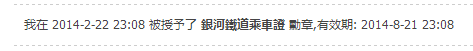

# 雙十一 優惠活動

作者：中文之許.

TID：20079

<title>1</title> <link href="../Styles/Style.css" type="text/css" rel="stylesheet">

# 1

為了慶祝雙11(台灣沒有在慶祝的XD) 還記得上一年的雙11，由於我在值班顧站，只能請放假的朋友出去幫我逛街買東西，結果他在街上被一個大叔騙了(他也不是大陸人，第一次接觸雙十一節，大叔纏住他，不斷要他買)

由於錢是我付的，當天值班到晚上9點多，買了一塊不能散熱的電腦版(記得花了不少)，直到今天這塊散熱板還在我的筆電下面(還是不能散熱)

ok，回歸正題，在11月9號~11月30號這段期間，只要您購買夢想的銀河鐵道勳章，通過審核者就可以免費獲得乙份銀河鐵道擴充站-縮小女夢想站的門票

而如果您先前已經購買過夢想的銀河鐵道勳章的人，且擁有50紅利點，通過審核也可以獲得乙份

想要申請此福利者，請在下面留下自己的名字，若是您主站跟縮小女副站的會員名稱不同的話也請留下您在縮小女副站的名稱，通過審核者將會把門票直接寄發到您的縮小女副站會員帳號中

附註:若是該帖的資源已停止分享、或是分享連結中斷、刪除等，請在下方的帖子留言，我會盡可能地補上資源(通常是晚上6點後)
[http://www.giantessnight.com/gnf ... hread&tid=15454](http://www.giantessnight.com/gnforumsw/forum.php?mod=viewthread&tid=15454)

由於目前分享於百度盤的資源時常被擅自拿下，所以目前還在尋找可以替代百度雲的網盤
<title>2</title> <link href="../Styles/Style.css" type="text/css" rel="stylesheet">

# 2

我之前買過鐵道徽章

然後免費得？還是要50紅利換？ <title>3</title> <link href="../Styles/Style.css" type="text/css" rel="stylesheet">

# 3

话说这个版块就是那些真人视频对吧   对我没啥吸引力   还是最喜欢漫画区 <title>4</title> <link href="../Styles/Style.css" type="text/css" rel="stylesheet">

# 4

-     -我倒是觉得真人比较好呃。然而并不够奖励点进去   PS：真的有人同时喜欢缩小女和巨大女吗？ 感觉喜欢缩小女就好像喜欢巨大男一样的赶脚 <title>5</title> <link href="../Styles/Style.css" type="text/css" rel="stylesheet">

# 5

既然不要啥东西，那就申请一下吧（ <title>6</title> <link href="../Styles/Style.css" type="text/css" rel="stylesheet">

# 6

还是没懂，像我这样有勋章但是红利点不足50的能行吗？ <title>7</title> <link href="../Styles/Style.css" type="text/css" rel="stylesheet">

# 7

<ignore_js_op>

**QQ截图20151108230337.png** *(3.83 KB, 下載次數: 0)*

[下載附件](forum.php?mod=attachment&aid=NTU5NDh8YjVjYTA4ZmZ8MTY3NDA2ODE1MnwxODIzMHwyMDA3OQ%3D%3D&nothumb=yes)

2015-11-8 23:04 上傳

这个先前购买过是 “只要购买过就OK”
                     还是 “最近购买过且还在有效期内"
呢？
<title>8</title> <link href="../Styles/Style.css" type="text/css" rel="stylesheet">

# 8

既然现在有铁道勋章 那就申请一波吧 <title>9</title> <link href="../Styles/Style.css" type="text/css" rel="stylesheet">

# 9

听说卖完勋章要随手水一下？ <title>10</title> <link href="../Styles/Style.css" type="text/css" rel="stylesheet">

# 10

抱歉 最近很忙....搞到現在才來給門票

各位保握最後機會吧(上面的都已經給了)</ignore_js_op>