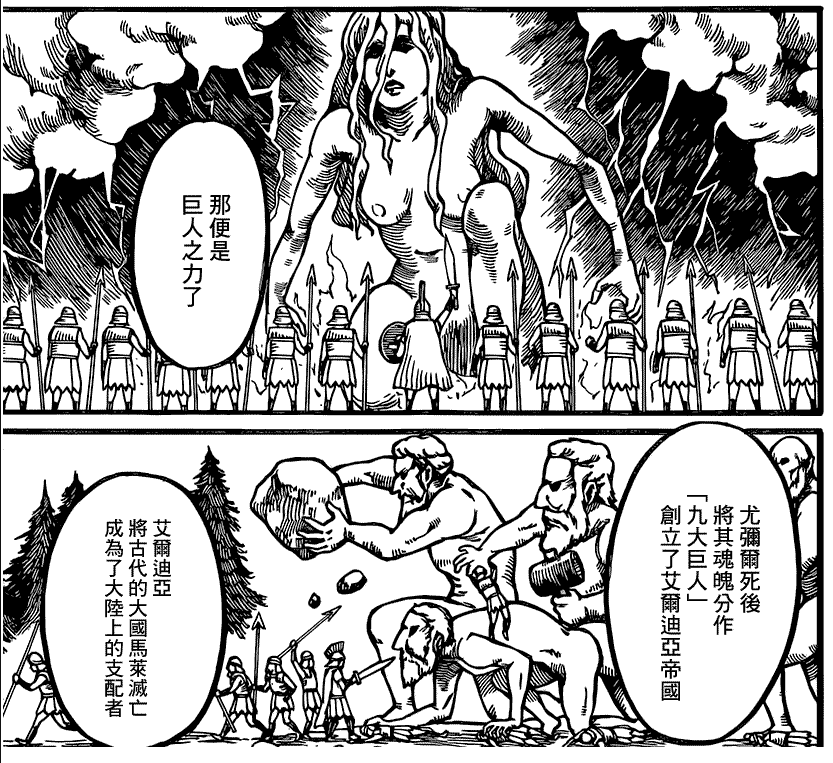

# 霓虹那边似乎真的对【母亲】有种特殊感觉呢

作者：werdexua12345

TID：22036

<title>1</title> <link href="../Styles/Style.css" type="text/css" rel="stylesheet">

# 1

<ignore_js_op>

**2345截图20161018023015.png** *(180.53 KB, 下載次數: 0)*

[下載附件](forum.php?mod=attachment&aid=NjUxNTB8NGUzZjI0ZTF8MTY3NDA2Nzg5MXwxODIzMHwyMjAzNg%3D%3D&nothumb=yes)

2016-10-22 17:24 上傳

进击的吃货新一话，始祖巨人的画像，又是这种【至高无上的神之母】的感觉，之前诸如fate系列或最终幻想等等，都有什么【全世界归于母亲】、【与之合而为一】的感觉。
在西方也有热议女巨人和女神的，但是一般都是个梗，调侃调侃。日本这边却总要如此一本正经（胡说八道）的。
<title>2</title> <link href="../Styles/Style.css" type="text/css" rel="stylesheet">

# 2

你这么一说我好像听说火影不就是类似于全世界归于母亲的这种情况了
真是发现了一个有点意思在母亲身上不清楚会发生什么 <title>3</title> <link href="../Styles/Style.css" type="text/css" rel="stylesheet">

# 3

應該一半一半。
雖然我沒讀歷史，但我想日本在部落時期(應該是大和部落)貌似是母系社會
在那時期日本人信仰象徵太陽，日本神祇最高統治的天照大神正是以女性形象在日本流傳。天照，太陽，女性，人自然很合理串聯一起，太陽是人的本，女性是太陽。世界各地都有神的概念，印証對人心的必然性，相反神是人心的反映。日本神既然是女性，那就免不了對社會觀念產生影響力。
上古社會種種諸多有趣事跡，以及各種因素，如此精緻的神秘傳說，又附合聽慣本土傳說的當地人的口味（所以有些作品海外人看不懂是正常），都對日本YY作給了個良好參考，各種作品不缺日本傳說甚麼。說日本人歪曲，其實是外人的看法。外國人眼中的中國修練升仙，日月精華是邪門歪道妖術，說是長生不老他們反而覺得是惡靈附體，棄舊換新，奪人身體的惡魔式長生不老。

一本正經胡說八道很重要
現在的作品不說正經講設定講背景，都沒點深度。講完看起來很繁雜，看不懂，突然又解說陰謀伏筆的前因後果開來，嗯很有深度，雖然邏輯對不上邊。

ＰＳ：我沒看過進擊 <title>4</title> <link href="../Styles/Style.css" type="text/css" rel="stylesheet">

# 4

我有超棒的同人本點子
女巨人幫小人蓋基礎建設，
小人會幫女巨人......呃..........
同人本你懂得 <title>5</title> <link href="../Styles/Style.css" type="text/css" rel="stylesheet">

# 5

> [3213213210 發表於 2016-10-22 22:00](https://giantessnight.cf/gnforum2012/forum.php?mod=redirect&goto=findpost&pid=312290&ptid=22036)
> 我有超棒的同人本點子
> 女巨人幫小人蓋基礎建設，
> 小人會幫女巨人......呃..........

女巨人幫小人蓋基礎建設我有想過，後者……
小人打掃女巨人手伸不進的角落（？），諸如冰箱的底，電視機後方等等
閣置爭議，取得共嬴（？）

<title>6</title> <link href="../Styles/Style.css" type="text/css" rel="stylesheet">

# 6

我只听说过霓虹那边母亲对儿子有感觉 <title>7</title> <link href="../Styles/Style.css" type="text/css" rel="stylesheet">

# 7

> [源青之绅 發表於 2016-10-23 08:53](https://giantessnight.cf/gnforum2012/forum.php?mod=redirect&goto=findpost&pid=312357&ptid=22036)
> 我只听说过霓虹那边母亲对儿子有感觉

噫~~</ignore_js_op>