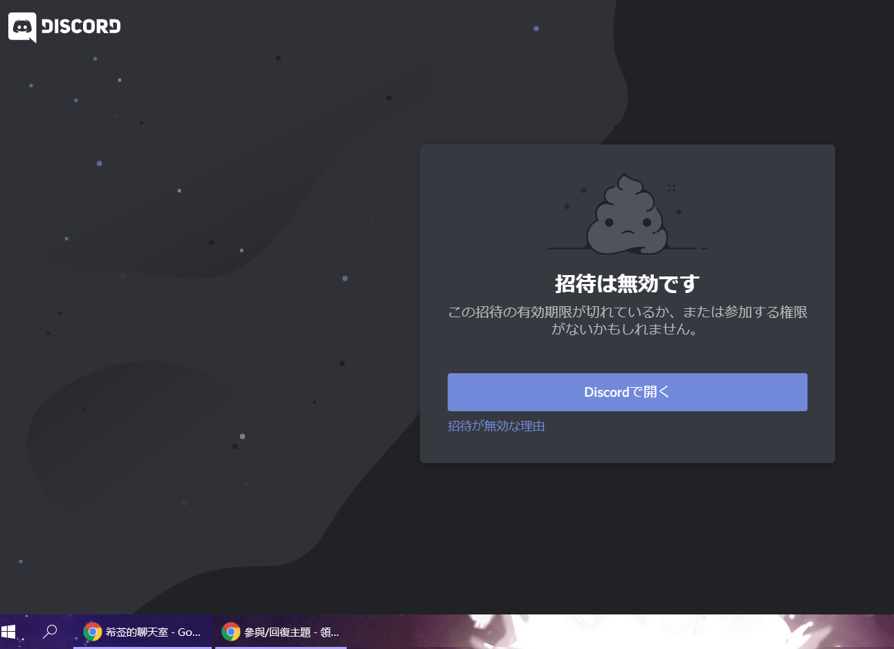

# 領頭羊

作者：希莶

TID：28410

<title>1</title> <link href="../Styles/Style.css" type="text/css" rel="stylesheet">

# 1

除了羊群中出現的領頭羊，領頭羊一詞還可以指代“先行者”。
在一個巨大娘和正常人生活的世界裡，雙方恪守道德規則。
可是突然有一天，巨大娘中的一個人違反了規則，開始破壞小人的文明。
小人曆經千辛萬苦把她打跑了。
但更多的巨大娘看到了摧毀羸弱不堪的小人文明時帶來的樂趣以及小小的代價。
她們摧毀了小人的世界，奴役並把小人們當做了玩具。
如果有一個小人站了出來，重新奪回屬於小人的人權。
他能不能算是領頭羊？儘管他犧牲了。

我最近建立了一個Discord的討論組，如果大家不介意的話，可以參加來討論一些問題：
https://discord.gg/kgJAYJc <title>2</title> <link href="../Styles/Style.css" type="text/css" rel="stylesheet">

# 2

Discord是不是有什么自带的限制啊，不可能1个小时就失效了吧，求解（创建新号就进应该是有效的，但是在邀请链接上登录之后就会显示无效，每次想进群组都是这样）

<title>3</title> <link href="../Styles/Style.css" type="text/css" rel="stylesheet">

# 3

 <ignore_js_op>[Snipaste_2020-04-04_22-47-06.png](forum.php?mod=attachment&aid=ODIyMDh8MzU3YjdiMjh8MTY3NDA2NjQ4MnwxODIzMHwyODQxMA%3D%3D&nothumb=yes) *(151.92 KB, 下載次數: 0)*

[下載附件](forum.php?mod=attachment&aid=ODIyMDh8MzU3YjdiMjh8MTY3NDA2NjQ4MnwxODIzMHwyODQxMA%3D%3D&nothumb=yes)

2020-4-4 22:49 上傳  

</ignore_js_op> <title>4</title> <link href="../Styles/Style.css" type="text/css" rel="stylesheet">

# 4

“打跑了”
是小人把巨大娘脚趾皮戳破了，巨大娘哭着回家了？公园小朋友打架？

“微小的代价”
既然有战争关系，那背景自然就不是爽文；巨大娘战败，那获得胜利的那一方自然是小人。
吞食，小人就绑着炸弹在巨大娘体内自爆；需要休息，小人就可以弄瞎巨大娘的双眼；和小人的建筑交合，就能修建能弹出倒刺拉出内脏的建筑

如果体型差距真的到了giga级别小人完全没有一战之力
先不说小人怎么把巨大娘打跑，之前巨大娘为什么会和一群微生物和谐相处？

这时候站出一个人，自我奉献让小人们重获尊严。
他是贝吉塔选择了自爆？
（贝吉塔自爆也没炸死布欧啊

唯一的解释是小人所谓的反抗，确实在一定程度上给巨大娘造成了困扰：吃太多小人，闹肚子了；让小人在广场乖乖站好让她踩死小人却总是四散而逃，闹心；威胁小人们如果不交出他们的领袖就摧毁一座城市，小人们宁可全民战死也不做叛徒，毫无成就感；时不时家里的网线、电源、水管还会被小人切断得找人维修。
于是巨大娘决定离开结束这场无聊的游戏。
于是其它巨大娘脑子坏掉了决定要接盘这场游戏？？

全程真的看不出什么逻辑关系，没法讨论
<title>5</title> <link href="../Styles/Style.css" type="text/css" rel="stylesheet">

# 5

> 深巷少女与猫 發表於 2020-4-4 23:24
> “打跑了”
> 是小人把巨大娘脚趾皮戳破了，巨大娘哭着回家了？公园小朋友打架？

我詢問的問題只不過是“領頭羊”的，問題，而不是“怎麼做，如何做，做到了嗎？”的問題。