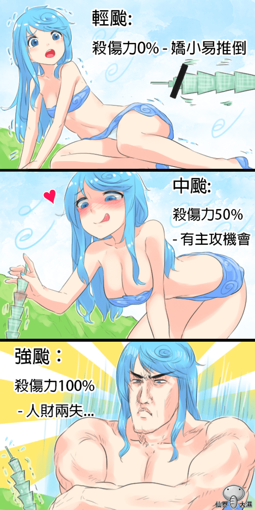

# 颱風娘集合

作者：spacewolves

TID：25516

<title>1</title> <link href="../Styles/Style.css" type="text/css" rel="stylesheet">

# 1

*本帖最後由 phone2345 於 2018-7-11 15:20 編輯*

颱風是非GTS愛好者也會來進行相關創作的日子，例如：(雖然都是老圖了，但應該也有人沒看過吧?)
<ignore_js_op>

**輕颱.png** *(147.67 KB, 下載次數: 0)*

[下載附件](forum.php?mod=attachment&aid=NzMxNjh8MmE5NjY2Y2Z8MTY3NDA2NjgxMHwxODIzMHwyNTUxNg%3D%3D&nothumb=yes)

2018-7-10 20:15 上傳

颱風分級
**作者**：仙界大濕
**來源**：巴哈姆特 [https://home.gamer.com.tw/creationDetail.php?sn=3000367](https://home.gamer.com.tw/creationDetail.php?sn=3000367)
<ignore_js_op>

**颱風強度.PNG** *(558.79 KB, 下載次數: 6)*

[下載附件](forum.php?mod=attachment&aid=NzMxNjl8NmIwNGJlMmV8MTY3NDA2NjgxMHwxODIzMHwyNTUxNg%3D%3D&nothumb=yes)

2018-7-10 20:19 上傳

颱風娘
**作者**：仙界大濕
**來源**：巴哈姆特 [https://home.gamer.com.tw/creationDetail.php?sn=2644974](https://home.gamer.com.tw/creationDetail.php?sn=2644974)
<ignore_js_op>

**颱風娘.JPG** *(91.73 KB, 下載次數: 1)*

[下載附件](forum.php?mod=attachment&aid=NzMxNzB8NDRiYzRmNjB8MTY3NDA2NjgxMHwxODIzMHwyNTUxNg%3D%3D&nothumb=yes)

2018-7-10 20:19 上傳

這個圖論壇也有人[發過了](https://giantessnight.com/gnforum2012/forum.php?mod=viewthread&tid=17396)，不過更令我在意的是[@Dante](https://giantessnight.cf/gnforum2012/home.php?mod=space&uid=1)  
  [曾說](https://giantessnight.com/gnforum2012/forum.php?mod=redirect&goto=findpost&ptid=17396&pid=229225)：「我這兒是還有不少颱風娘的圖...」
不知道能否分享一下呢？

除了圖片，論壇也有文學創作喔！還挺帶感的，提供連結給大家回味一下：

[**【短篇】颱風**](https://giantessnight.com/gnforum2012/forum.php?mod=viewthread&tid=21885)
**作者**：[@choulan](https://giantessnight.cf/gnforum2012/home.php?mod=space&uid=13000)
**屬性**：巨大女性
**連結**：[https://giantessnight.com/gnforum2012/forum.php?mod=viewthread&tid=21885](https://giantessnight.com/gnforum2012/forum.php?mod=viewthread&tid=21885)

<title>2</title> <link href="../Styles/Style.css" type="text/css" rel="stylesheet">

# 2

哇偶，好可爱的人设与设定啊！ <title>3</title> <link href="../Styles/Style.css" type="text/css" rel="stylesheet">

# 3

新图都会上的，热图修复了就变这样了…… <title>4</title> <link href="../Styles/Style.css" type="text/css" rel="stylesheet">

# 4

我這也有一張天兔的，忘記是誰畫的了，當時天兔以瞬間之姿成長真的是有造成很多傷害 <ignore_js_op>

**001.JPG** *(118.75 KB, 下載次數: 0)*

[下載附件](forum.php?mod=attachment&aid=NzMxNzJ8ZDhkODk3YzF8MTY3NDA2NjgxMHwxODIzMHwyNTUxNg%3D%3D&nothumb=yes)

2018-7-10 23:01 上傳

<ignore_js_op>

**002.JPG** *(126.54 KB, 下載次數: 0)*

[下載附件](forum.php?mod=attachment&aid=NzMxNzF8YjU2ODA1Njh8MTY3NDA2NjgxMHwxODIzMHwyNTUxNg%3D%3D&nothumb=yes)

2018-7-10 23:01 上傳

<title>5</title> <link href="../Styles/Style.css" type="text/css" rel="stylesheet">

# 5

这个脑洞。。。                                                                      <title>6</title> <link href="../Styles/Style.css" type="text/css" rel="stylesheet">

# 6

非常可爱。一切都是・・・。 <title>7</title> <link href="../Styles/Style.css" type="text/css" rel="stylesheet">

# 7

這颱風娘看得我都興奮了，真的是什麼都能擬人呢。 <title>8</title> <link href="../Styles/Style.css" type="text/css" rel="stylesheet">

# 8

真是万物都可以娘化呢。
话说有没有用这个脑洞写篇文章啊，感觉是个有趣的童话故事 <title>9</title> <link href="../Styles/Style.css" type="text/css" rel="stylesheet">

# 9

[https://giantessnight.com/dgustory/other_story/twind.htm](https://giantessnight.com/dgustory/other_story/twind.htm)
但大不是很早就已经写过台风娘了吗
<title>10</title> <link href="../Styles/Style.css" type="text/css" rel="stylesheet">

# 10

我很佩服那个疑似北斗神拳画风（实际上不是的吧）强台，6个里就他画风最清奇 <title>11</title> <link href="../Styles/Style.css" type="text/css" rel="stylesheet">

# 11

*本帖最後由 spacewolves 於 2018-12-8 00:37 編輯*

暑假被台风安比困在上海导致多滞留一天，多花一天住宿费的路过，糟糕的是那天还不能出门去玩，在虹桥火车站听到消息时的第一想法就是如果台风是个妹子或许我能原谅她。
顺便............某位管理员能不能体谅一下某位不会说中文需要用翻译机的？ <title>12</title> <link href="../Styles/Style.css" type="text/css" rel="stylesheet">

# 12

不得不说，我被强飓吓到了-_-||</ignore_js_op></ignore_js_op></ignore_js_op></ignore_js_op></ignore_js_op>