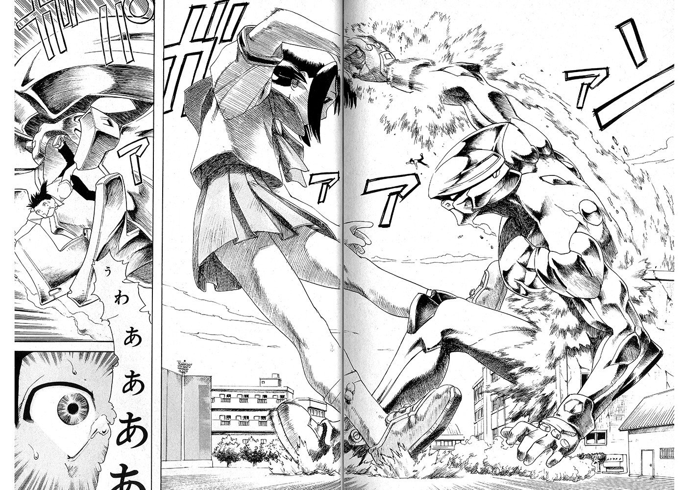

# 骨灰級漫畫~上山道郎 1987年 ＜大巨人來襲＞

作者：神父桑

TID：34422

<title>1</title> <link href="../Styles/Style.css" type="text/css" rel="stylesheet">

# 1

分享一個老漫畫，小時候有在G-zone網站有介紹GTS的漫畫，大部分都是老漫畫很少在網路找得到資源。

最近偶然發現以前的啟蒙作，作者2019年竟然主動在Twitter主動分享，有點類似女主巨大化跟奧特曼對打的情節。

分享給大家看一下，不知道版上有沒有人分享過。

圖片來源：作者Twitter

https://twitter.com/ueyamamichiro/status/1110474564717285376
<title>2</title> <link href="../Styles/Style.css" type="text/css" rel="stylesheet">

# 2

 <ignore_js_op>[D2mKGhOVAAUCcJR.jpg](forum.php?mod=attachment&aid=MTAwNTA0fDkxYWMyNGRhfDE2NzQwNjkyNDZ8MTgyMzB8MzQ0MjI%3D&nothumb=yes) *(431.26 KB, 下載次數: 3)*

[下載附件](forum.php?mod=attachment&aid=MTAwNTA0fDkxYWMyNGRhfDE2NzQwNjkyNDZ8MTgyMzB8MzQ0MjI%3D&nothumb=yes)

2022-11-17 22:31 上傳  

</ignore_js_op> <ignore_js_op>[D2mKHxEVYAIuGHH.jpg](forum.php?mod=attachment&aid=MTAwNTAzfDgyY2Q5ZTMzfDE2NzQwNjkyNDZ8MTgyMzB8MzQ0MjI%3D&nothumb=yes) *(315.3 KB, 下載次數: 3)*

[下載附件](forum.php?mod=attachment&aid=MTAwNTAzfDgyY2Q5ZTMzfDE2NzQwNjkyNDZ8MTgyMzB8MzQ0MjI%3D&nothumb=yes)

2022-11-17 22:31 上傳  

</ignore_js_op> <ignore_js_op>[D2mKI6vUgAEem5y.jpg](forum.php?mod=attachment&aid=MTAwNTAyfGQxYjFjN2I0fDE2NzQwNjkyNDZ8MTgyMzB8MzQ0MjI%3D&nothumb=yes) *(444.19 KB, 下載次數: 1)*

[下載附件](forum.php?mod=attachment&aid=MTAwNTAyfGQxYjFjN2I0fDE2NzQwNjkyNDZ8MTgyMzB8MzQ0MjI%3D&nothumb=yes)

2022-11-17 22:31 上傳  

</ignore_js_op> <title>3</title> <link href="../Styles/Style.css" type="text/css" rel="stylesheet">

# 3

> [田棒棒 發表於 2022-11-17 23:39](https://giantessnight.cf/gnforum2012/forum.php?mod=redirect&goto=findpost&pid=519862&ptid=34422)
> 这个女的好像是大机器人的说

是机器人没错，妹妹的本体在那个巨大机器人的领带环里面，虽说不是真人巨大化，但圈外能有这种程度很不错了，可能作者本身也有那么点这圈子的爱好吧

<ignore_js_op>

**05ea51d451179ebfda25c1bea81f9fc0.jpg** *(396.24 KB, 下載次數: 1)*

[下載附件](forum.php?mod=attachment&aid=MTAwNTA1fDZmYTI3YTJmfDE2NzQwNjkyNDZ8MTgyMzB8MzQ0MjI%3D&nothumb=yes)

2022-11-17 23:53 上傳

<ignore_js_op>

**8465a97c9fa3e1825f1e0bc276c1ab46.jpg** *(349.59 KB, 下載次數: 1)*

[下載附件](forum.php?mod=attachment&aid=MTAwNTA2fGVjZGNjYTM0fDE2NzQwNjkyNDZ8MTgyMzB8MzQ0MjI%3D&nothumb=yes)

2022-11-17 23:53 上傳

<title>4</title> <link href="../Styles/Style.css" type="text/css" rel="stylesheet">

# 4

哇，真的是骨灰级了，非常有年代感。楼主可以 <title>5</title> <link href="../Styles/Style.css" type="text/css" rel="stylesheet">

# 5

> [田棒棒 發表於 2022-11-18 09:30](https://giantessnight.cf/gnforum2012/forum.php?mod=redirect&goto=findpost&pid=519885&ptid=34422)
> 其实圈外就是讲巨大化的也不少的说，有巨大通常是别的巨大的比较多，是巨大娘的反而相对少数的样子。比如 ...

圈外gt比gts多很正常，网文看得多的就知道，一般巨大化是力量的象征，如果那些作者又没有圈内爱好，给男性角色用很正常，不必要多说。当然，不排除有的作者也是有size爱好的，但不是gts，所以他们的作品也还是会有gt，比如你提到的这个漫画叫99强化木棍的作者jipley，他之前是画男同♂本的，p站还有号，不排除他本身就是gt爱好者的可能性，他之前的几部漫画都有各种gt擦边和剧情，他的漫画还被gl那边的gt爱好者当圈外漫画情报分享过的。
如果说他本身也对size感兴趣再加上他取向是同，那他在自己的正常向漫画里添点私货也正常不过了，那个漫画的主人公星球级giga巨大化我在一个月前就知道了，早在gl的群里就被讨论过了。
当然，也有可能是单纯圈外的巧合，那作者也并不是什么gt爱好者，只是他凑巧擦边到size内容来了，毕竟巨大化什么都要素在圈外也越来越常见了，以上这也只是我个人的瞎jb乱猜
<title>6</title> <link href="../Styles/Style.css" type="text/css" rel="stylesheet">

# 6

*本帖最後由 神父桑 於 2022-11-19 11:50 編輯*

> 田棒棒 發表於 2022-11-19 10:01
> 最近国漫好像又有很多法天象地巨大化的，据说那个漫画《氪金大佬》章节135话“意外之人” 一章 似乎又有 ...

巨大化讲真在圈外人眼里并没有和xp扯上关系，圈外人和size圈比起来那是绝大部分的，国漫里面找gt那不是挺容易的吗？但你要找gts就难了，尽量别在国漫网文里面找gts内容，否则你绝对会失望的。当然你要是找纯gt，那说不定收货不小，搜索引擎输入个法天象地，巨大化之类的关键词就能搜到一大堆了 <title>7</title> <link href="../Styles/Style.css" type="text/css" rel="stylesheet">

# 7

> [田棒棒 發表於 2022-11-21 06:53](https://giantessnight.cf/gnforum2012/forum.php?mod=redirect&goto=findpost&pid=520105&ptid=34422)
> 其实讲女的大的也有的，就是狐妖小红娘，也有什么法相天地

嗯，其实是"法天象地"，我觉得应该是作者文化水平不够，所以就出来了个"法相天地"。（我个人瞎猜的）
想必你应该挺喜欢狐妖小红娘这作品吧？我看你之前还提过这作品不少次</ignore_js_op></ignore_js_op>