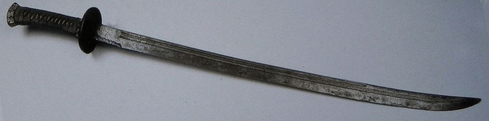
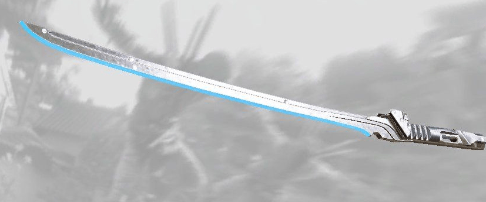
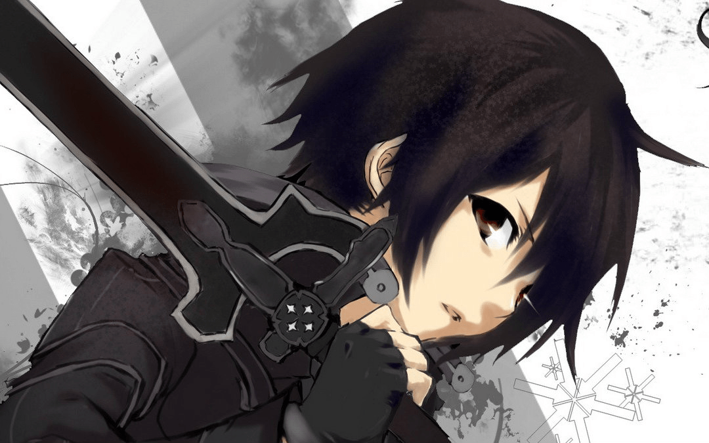
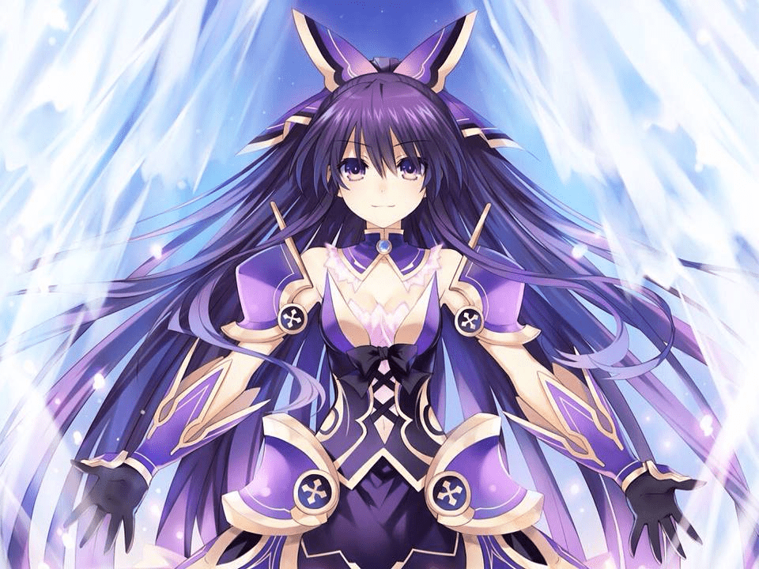
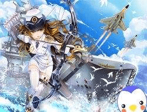
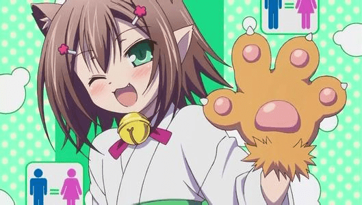
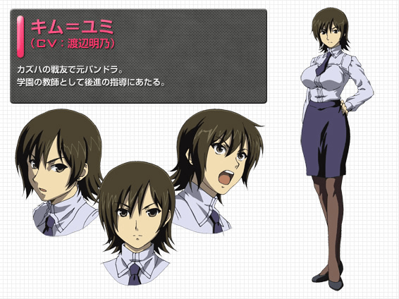

# 魔法（mag）x科技（tek）学院 招人帖

作者：四白

TID：22817

<title>1</title> <link href="../Styles/Style.css" type="text/css" rel="stylesheet">

# 1

*本帖最後由 四白 於 2017-8-11 13:40 編輯*

龙套需使用以下格式

男主资料：

姓名:铂 

职业：剑专修，多职业（包括大部分职业，魔法师召唤师剑士弓兵枪兵任你选）

 性别：大老爷们（可以是伪，我正打算训练一下）

种族：人，有血族的狂暴能力（种族包括：血族，巨人族，幻想族，翼人族，神灵族，人族，兽族（不是兽人永不为奴，其实身体和人族一样，就是多了兽耳和兽尾），海灵族。）

技能（需要带有描述）：蜂刺（在狭小地区通过多次在墙壁上弹射提高速度，造成多段伤害。后期学会虫洞技能后更强。）

黑光（自身幻影化突进一小段时间，现身后形成一小段直线上的较高伤害突进。）

血之狂暴（被动技能）：在极度愤怒或极度兴奋时会狂暴，不会丧失理智，但会稍微变化人格，获得许多异能。

异能：子弹折射、缴械、自动装弹等

扇：一个多功能技能，可以做范围蓄力攻击，可以破除敌人防御，可以防御反击，可以通过物体位移。

必杀：前期：蜂刺·乱（蜂刺的升级版，速度更快，伤害更高）

中期：二刀流·断（百分百装备破坏技能，一把剑招架，另一把剑破坏。之后追加一次强化后的二刀乱舞）

后期：秘机甲·彼岸之花（召唤飞空机甲，可以将所有武器装备，还佩戴专属激光剑与专属镭射散弹枪）

剑技（可有可无）（这个主要指这个职业的特殊技能）：二刀流：同时使用两把剑，拥有斩（双刀五连击），破（范围剑压），乱舞（不规则多次连击）等特殊招数。

武器：黯钢： <ignore_js_op></ignore_js_op>  **QQ图片20170513191416.png** *(385.75 KB, 下載次數: 0)*

[下載附件](forum.php?mod=attachment&aid=NjgxMjF8NTA5YTQxYzB8MTY3NDA2NzUzNXwxODIzMHwyMjgxNw%3D%3D&nothumb=yes)

黯钢

2017-5-30 11:44 上傳

使用暗影金属制造的剑，被铂的父亲锇传给铂，具有暗属性能力。

R45-极光： <ignore_js_op></ignore_js_op>  **R45极光.png** *(189.43 KB, 下載次數: 0)*

[下載附件](forum.php?mod=attachment&aid=NjgxMjJ8M2E1MjU3OWV8MTY3NDA2NzUzNXwxODIzMHwyMjgxNw%3D%3D&nothumb=yes)

2017-5-30 12:24 上傳

气科技武士刀，能增强持有者的属性。且剑士的必杀技：蛮力挥砍需要的力量减小，因此可以连发，但是伤害较低。据说有第二个形态，但是没有被发掘出来。

关系：和几乎所有登场角色都认识（龙套除外）

背景（主角必须留）：祖父曾是MT战争的中校，自幼受家庭熏陶开始学习战斗技能。12岁时父母被吸血族的刺客暗杀，自己却因为某种力量学会了吸血族的狂暴技能。现与表妹铱就读于MT学院1年（这个学院一共要上6年）

预览图（这个可有可无，但为了加强灵感，建议留一张）： <ignore_js_op></ignore_js_op>  **59ab8e5c5f07af1933cb95798c814332.jpg** *(128.13 KB, 下載次數: 0)*

[下載附件](forum.php?mod=attachment&aid=Njc0MTB8ZjIwMWRiY2V8MTY3NDA2NzUzNXwxODIzMHwyMjgxNw%3D%3D&nothumb=yes)

别误会，我只让大家看样子

2017-3-28 19:31 上傳 

（我不看刀剑，真的！）

女主资料：

姓名：莎娜

职业：弩手，为迎合传统也有很高的魔法等级。

性别：女

种族：海灵族（海灵族只在水里可以按照意愿变出鱼尾巴）

武器：作为弩手有两把弩：矢（伤害与射程不亚于狙击步枪，最大精度，但需要更长的时间拉弓及上箭），弦（火力与箭矢容量超大，射速不低于MG42，但开火时不能移动）（两把弩都可以通过布置成炮台来自主射击和移动）

作为法师有一把翡翠法杖和增加能力的琉璃戒指。

技能：静之矢：使发射时的噪音，箭矢滑坡气流的噪音，射到物体上的噪音消失。

海流箭矢：使箭矢附带水属性。

水是我的朋友（被动技能）：进入水中后难以被侦测，速度加快3倍，自动触发静之矢和海流箭矢。

必杀：前期：破浪：召唤海浪（行进方向和位置由自己控制）吞噬面前所有敌人，之后释放一支穿透性极高的箭矢，解触海浪后爆炸，造成大范围水属性伤害。

中期：水龙卷：朝一个地方发射一支汲取地下水的箭矢，之后在那个地方引导一个巨大的水龙卷，从水龙卷中会蹦出各种鱼进行捕猎，水龙卷还会释放水柱。

后期：灾难·鲲之海啸：各种族最强技能之一，召唤一场比印度洋海啸严重300倍的海啸，之后召唤远古巨兽·鲲。北冥有鱼，其名为鲲，鲲之大，一锅炖不下（强行植入刮刮乐）

固有技能：武器解放：将两把弩合二为一，变成神弩·狂战士，拥有两把弩所有的优点，而且机动性满分。

性格：在众人面前是一位优雅的皇女，但私底下却是一个天然呆的平常少女，有些许腹黑性格。

背景：海灵族的皇女，从小在宫里努力修炼，因为是皇族需要礼仪所以诞生了皇女性格，但私下会有自己的天然呆性格。在和弟弟转学的途中被血族偷袭，只剩下自己和弟弟逃脱，之后便深深的自责。（当时有专门克制弩和魔法的兵种在，武器施展不开。）在铂的开导下恢复。

因为铂多次救了自己，喜欢铂，看见铂与别的女性靠的很近会吃醋，甚至黑化。据本人称：丈母娘也不许靠近（虽然铂的母亲早死了）（再次强行植入刮刮乐）

预览图（二代）： <ignore_js_op></ignore_js_op>  **72bc4536ac19b6f95cd80455816af6e0.jpg** *(103.93 KB, 下載次數: 0)*

[下載附件](forum.php?mod=attachment&aid=Njg3MTZ8OTFhNmU4Y2R8MTY3NDA2NzUzNXwxODIzMHwyMjgxNw%3D%3D&nothumb=yes)

2017-7-9 13:01 上傳

（果然之前的自己喜欢上自己太怪了。）

（都说了我没看过刀剑！）

我已经准备好了让所有龙套都成为主角 

<title>2</title> <link href="../Styles/Style.css" type="text/css" rel="stylesheet">

# 2

姓名:雷蒙

职业：机械师

性别：妹子

种族：巨人族
技能（需要带有描述）：收放自如（可以将身体变成普通人大小或更大的巨人）
快速修理（利用自己的机械知识快速修复装备）
火力全开（向某一目标倾泻魔法弹药）

武器：机械护甲：身为巨人时使用机械护甲保护自己，和普通人一样大时，机械护甲会组装为移动载具和武器

必杀：强化装甲——用魔法强化自己的装备使其更加耐受打击

关系：你看着编！ <title>3</title> <link href="../Styles/Style.css" type="text/css" rel="stylesheet">

# 3

姓名：粉月
职业：学生
性别：女
种族：人族
技能：身高调配（可以吸收他人身高，或将身高给予他人）
物质转换。泰迪（可以将任何东西变成一个40cm大的玩具熊，可以行动与对话）
学海无崖（利用知识的力量，将敌人陷入土地中，仅在土地有效）
学习万岁（敌人死后，自动变成身高1cm的仆从，仆从只会服从命令）
武器：语文书：初中三年级上册语文书，但其中的的内容却没人知道
必杀：知识海洋：使敌人被泡泡包裹，使其不能动弹直至泡泡破裂
关系：不知道。。。 <title>4</title> <link href="../Styles/Style.css" type="text/css" rel="stylesheet">

# 4

> [qreeper 發表於 2017-3-27 20:20](https://giantessnight.cf/gnforum2012/forum.php?mod=redirect&goto=findpost&pid=327467&ptid=22817)
> 姓名：粉月
> 职业：学生
> 性别：女

真巧，我是初三的
过吧
<title>5</title> <link href="../Styles/Style.css" type="text/css" rel="stylesheet">

# 5

> [445566 發表於 2017-3-27 07:08](https://giantessnight.cf/gnforum2012/forum.php?mod=redirect&goto=findpost&pid=327385&ptid=22817)
> 姓名:雷蒙
> 
> 职业：机械师

其实我一直在找科技召唤师，却忘了有这茬。。很好，过
<title>6</title> <link href="../Styles/Style.css" type="text/css" rel="stylesheet">

# 6

> [四白 發表於 2017-3-27 20:24](https://giantessnight.cf/gnforum2012/forum.php?mod=redirect&goto=findpost&pid=327468&ptid=22817)
> 真巧，我是初三的
> 过吧

                                                           
<title>7</title> <link href="../Styles/Style.css" type="text/css" rel="stylesheet">

# 7

*本帖最後由 EIec 於 2017-3-28 21:23 編輯*

姓名：诺维克职业：枪炮师
性别：男偏中性
种族：翼人族
武器：各种枪械，常用12.7mm反器材步枪，11式榴弹狙（炸逼综合征末期），AA12霰弹枪（被近身时用）
技能：
武器训练（可以熟练使用大多数枪炮类武器，包括且不限于反器材步枪、通用机枪、肩扛式导弹、榴弹发射器等常规与非常规武器）
高速移动（被动种族天赋，字面意思）
目标标记（将锁定的目标高亮表示在所有友军的视野中）
过载射击（暂时解除武器的保险措施，令武器的射速提高至250%，之后武器彻底报废）
口袋工厂（其实就是打开一个连接着武器库的空间通道，里面储存着足够支持一场小型战争的武器）
必杀：
前期：毁灭空袭（飞上天空并将库存的所有火力投射至目标区域）
中期：轨道轰炸（请求天基轨道炮轰炸目标区域）
后期：核平主义（将一个聚变核弹头超时空传送至目标点并引爆）
关系：编不出来了
背景：MT学院3年级，父母都是兵器研发人员，从小就对枪械抱有特殊的感情，将它们视为自己的挚友。同时因为父母的关系所以对各种尖端技术也有所了解，喜欢用各种相对成熟的技术改装自己的武器。
（这是一个非常科学的魔法世界，嗯）
预览图？我找找······参考一下V哥怎么样（笑）
<title>8</title> <link href="../Styles/Style.css" type="text/css" rel="stylesheet">

# 8

> [EIec 發表於 2017-3-27 22:20](https://giantessnight.cf/gnforum2012/forum.php?mod=redirect&goto=findpost&pid=327487&ptid=22817)
> 姓名：诺维克职业：枪炮师
> 性别：男偏中性

恩，这是一个非常好的人物，就选你做男二了。
此外，资料需更新，格式我在一开始改了
<title>9</title> <link href="../Styles/Style.css" type="text/css" rel="stylesheet">

# 9

> [qreeper 發表於 2017-3-27 20:44](https://giantessnight.cf/gnforum2012/forum.php?mod=redirect&goto=findpost&pid=327472&ptid=22817)

资料需更新，格式我在一开始改了
<title>10</title> <link href="../Styles/Style.css" type="text/css" rel="stylesheet">

# 10

> [四白 發表於 2017-3-27 20:26](https://giantessnight.cf/gnforum2012/forum.php?mod=redirect&goto=findpost&pid=327469&ptid=22817)
> 其实我一直在找科技召唤师，却忘了有这茬。。很好，过

资料需更新，格式我在一开始改了
<title>11</title> <link href="../Styles/Style.css" type="text/css" rel="stylesheet">

# 11

姓名：粉月
职业：学生
性别：女
种族：人族
技能：身高调配（可以吸收他人身高，或将身高给予他人）
物质转换。泰迪（可以将任何东西变成一个40cm大的玩具熊，可以行动与对话）
学海无崖（利用知识的力量，将敌人陷入土地中，仅在土地有效）
学习万岁（敌人死后，自动变成身高1cm的仆从，仆从只会服从命令）
武器：语文书：初中三年级上册语文书，但其中的的内容却没人知道
必杀：前期：知识海洋：使敌人被泡泡包裹，使其不能动弹直至泡泡破裂
         中期：画龙点睛：召唤神龙追击敌人，神龙消失后神龙的眼睛会爆炸
         后期：二龙戏珠：召唤龙珠与两条神龙，神龙会跟着龙珠飞，神龙追到龙珠后龙珠会爆炸，并使神龙进入狂暴模式
异能：被粉月仇恨的人看见粉月的眼睛时无法动弹，直至死亡或被粉月解开（破解方法：被定身时，心中背诵桃花源记则可破解）
         可以感应到敌人的位置
关系：不知道。。。 <title>12</title> <link href="../Styles/Style.css" type="text/css" rel="stylesheet">

# 12

名字：晴愈
职业：医生
性别：女
种族：人族
技能：神佑：赋予一个人可吸收大量伤害的护盾
        螺旋升天：螺旋升天，并快速降落并对范围内人物造成伤害，并眩晕
        中央控制系统：晴愈使用意念，并开启控制天赋，令范围内人物产生幻觉
武器：急救箱（可以随时给人治疗，遇到危险可以用来砸人）
     必杀     前期：圣光加持：用圣光包裹自己，一旦收到伤害则反弹，持续10秒
                中期：圣光加持2：用圣光包裹自己，一旦收到伤害则反弹，持续十秒，十秒后，圣光扩散，碰到圣光的队友受到治疗，并加速，碰到圣光的敌人则中毒
          后期：神怒：心跳大于200时晴愈会进入狂暴状态并失去所有技能直至狂暴结束，（抉择 1.进入狂暴状态后体型变大x倍，x为触发狂暴的心跳数－100－－－－－2.体型变大10倍并将急救箱变成手持机枪，并进入无敌状态）
异能：自愈：每5分钟可治愈所有伤口，死亡后24小时复活

<title>13</title> <link href="../Styles/Style.css" type="text/css" rel="stylesheet">

# 13

姓名:雷蒙

职业：机械师

性别：妹子

种族：巨人族
原本身高：40m
技能（需要带有描述）：收放自如（可以将身体变成普通人大小或更大的巨人）
快速修理（利用自己的机械知识快速修复装备）
火力全开（向某一目标倾泻魔法弹药）

武器：机械护甲：身为巨人时使用机械护甲保护自己，和普通人一样大时，机械护甲会组装为移动载具和武器

必杀：
前期：强化装甲——用魔法强化自己的装备使其更加耐受打击
中期：弹性装甲——在之前的基础上让自己的装甲拥有自主修复的能力（来自于自主研发）
后期：反射装甲——在之前基础上让装甲可以反射伤害（来自于自主研发）
关系：你看着编！

背景（主角必须留）：巨人族天才机械师，智商在巨人族中出类拔萃。擅长机械修理和制造。在机械制造中意外开发出了可以利用脑波控制身体大小的装置，并且装进了自己的大脑。不愿意显露自己的巨人族身份，不想被普通人用对待巨人的方式对待，因此除非必要，很抗拒巨大化。 <title>14</title> <link href="../Styles/Style.css" type="text/css" rel="stylesheet">

# 14

> [445566 發表於 2017-4-2 22:55](https://giantessnight.cf/gnforum2012/forum.php?mod=redirect&goto=findpost&pid=328059&ptid=22817)
> 姓名:雷蒙
> 
> 职业：机械师

40m在巨人族里算小的。。。
<title>15</title> <link href="../Styles/Style.css" type="text/css" rel="stylesheet">

# 15

> [四白 發表於 2017-4-3 08:28](https://giantessnight.cf/gnforum2012/forum.php?mod=redirect&goto=findpost&pid=328111&ptid=22817)
> 40m在巨人族里算小的。。。

因为头脑好所以不想被当做肉盾一样的东西对待，总之除非万不得已不想巨大化就对了 <title>16</title> <link href="../Styles/Style.css" type="text/css" rel="stylesheet">

# 16

> [445566 發表於 2017-4-2 22:55](https://giantessnight.cf/gnforum2012/forum.php?mod=redirect&goto=findpost&pid=328059&ptid=22817)
> 姓名:雷蒙
> 
> 职业：机械师

还是搞个预览图吧，不然我灵感有点难以迸发
<title>17</title> <link href="../Styles/Style.css" type="text/css" rel="stylesheet">

# 17

> [四白 發表於 2017-5-17 21:11](https://giantessnight.cf/gnforum2012/forum.php?mod=redirect&goto=findpost&pid=332733&ptid=22817)
> 还是搞个预览图吧，不然我灵感有点难以迸发

实在也找不到合适的了 <title>18</title> <link href="../Styles/Style.css" type="text/css" rel="stylesheet">

# 18

 <ignore_js_op>[timg.jpg](forum.php?mod=attachment&aid=Njc5MTF8YWY1MDYyMWZ8MTY3NDA2NzU1N3wxODIzMHwyMjgxNw%3D%3D&nothumb=yes) *(14.78 KB, 下載次數: 0)*

[下載附件](forum.php?mod=attachment&aid=Njc5MTF8YWY1MDYyMWZ8MTY3NDA2NzU1N3wxODIzMHwyMjgxNw%3D%3D&nothumb=yes)

2017-5-18 06:18 上傳  

</ignore_js_op> <title>19</title> <link href="../Styles/Style.css" type="text/css" rel="stylesheet">

# 19

> [445566 發表於 2017-5-18 06:18](https://giantessnight.cf/gnforum2012/forum.php?mod=redirect&goto=findpost&pid=332782&ptid=22817)
> 实在也找不到合适的了

没关系，这样挺不错的了。
其实我之前将雷蒙设定成了一个绿头发（怠惰！怠惰！怠惰！！！）

<title>20</title> <link href="../Styles/Style.css" type="text/css" rel="stylesheet">

# 20

*本帖最後由 TANGLUNG 於 2017-5-18 23:15 編輯*

姓名：王小明
职业：伪装成路人甲的特工
性别：男
种族：人族
武器：激光剑、魔法产生器（套在右手上的手环状装置）
技能：
特工技能——一位特工必备的各种技巧，包括多种语言、潜入、射击、暗杀、开锁、情报搜集等等
独孤九剑——无招胜有招的传奇剑法，在各种情况下都能不落下风
魔法合成——使用魔法产生器将各种本来毫不相容的魔法融合，不同的合成可以产生不同的效果
时轮结界——使用魔法产生器制造一个可以增快/减慢时间流速的结界
必杀：
咖喱鸡块棒——将魔法产生器与激光剑相连，在一瞬间释放出非常巨大的能量
关系：小黛（见楼下）的搭档
背景：某神秘组织“有关部门”的特工

<ignore_js_op>

**lrj.JPG** *(21.97 KB, 下載次數: 0)*

[下載附件](forum.php?mod=attachment&aid=Njc5MjN8OTMwZmE0MDl8MTY3NDA2NzU1N3wxODIzMHwyMjgxNw%3D%3D&nothumb=yes)

2017-5-19 06:15 上傳

<title>21</title> <link href="../Styles/Style.css" type="text/css" rel="stylesheet">

# 21

姓名：小黛
职业：伪装成路人甲的特工
性别：女
种族：人族
武器：手枪
技能：
特工技能——一位特工必备的各种技巧，包括多种语言、潜入、射击、暗杀、开锁、情报搜集等等
魔弹——不使用手枪，直接在手上聚集能量化作子弹发射出去
必杀：
巨大化——暂时性的巨大化，大小和巨大化的时间会随着战斗经验的提升而提高
关系：王小明（见楼上）的搭档
背景：某神秘组织“有关部门”的特工，身体经过某些改造并拥有了一些超能力，性格腹黑

<ignore_js_op>

**捕获.JPG** *(24.39 KB, 下載次數: 0)*

[下載附件](forum.php?mod=attachment&aid=Njc5MjR8M2UxNzRiODR8MTY3NDA2NzU1N3wxODIzMHwyMjgxNw%3D%3D&nothumb=yes)

2017-5-19 06:22 上傳

<title>22</title> <link href="../Styles/Style.css" type="text/css" rel="stylesheet">

# 22

> [TANGLUNG 發表於 2017-5-19 06:21](https://giantessnight.cf/gnforum2012/forum.php?mod=redirect&goto=findpost&pid=332912&ptid=22817)
> 姓名：小黛
> 职业：伪装成路人甲的特工
> 性别：女

都过吧，但是我决定不写gts所以巨大化没什么用（除非在雷蒙那章）
<title>23</title> <link href="../Styles/Style.css" type="text/css" rel="stylesheet">

# 23

新人物。。。

就是在最近的更新里出现的莉亚！

 姓名：莉亚 
 职业：格斗家 
 性别：女 
 种族：兽族（猫妖种） 
 技能：基础格斗术：指每个格斗家入门时都要学习的能力，包括基础的勾拳、下段踢、冲撞等

白影：莉亚独创技能，人称“闪避的化境”。任何攻击都可以百分百使用空翻闪避。但是需要耗费许多体力。

肉球猛击：同样是莉亚独门技能。将自己的手变成猫肉球大锤砸开范围内敌人，很大几率造成晕眩。

舔毛：应急治疗，可以缓慢恢复自己生命，而且在舔毛时间内免疫负面BUFF。

午睡：猫族特有技能，极速恢复自己的所有状态。在主动发动时可以被叫醒或按照自己的意愿醒来。而在中午十二点是固定发动，时间一小时，而且无法被叫醒。

兽族特有技能：血坏：比血族狂暴强大许多倍的能力、增加视觉、听觉、嗅觉和触觉。但是会极大增强战斗欲望，而且会付出极大的代价。危急时还会七窍流血。

必杀：前期：格斗术·连击：以极快的速度穿梭敌人并对一个敌人进行极快的连击，并为对方施加流血BUFF

中期：血坏·爆血：将血坏提升到最高高度，获得篡改敌人记忆和划破时间以及预知未来的能力。同时血坏时不会付出任何代价。并收集所有附近的血液，将它们注入到敌人身上以制造人体炸弹或恢复自己生命。代价为血坏结束后会进行48小时的休眠，且可能被反噬。

后期：酒池肉林：创造一个幻想乐园。无论谁都会短暂地消失战斗欲望，而且低级敌人会无法苏醒。莉亚在其中会进入血坏的突破状态，获得加强的全部能力并且没有任何负面效果。

关系：铂的青梅竹马，与铂非常要好，包括现在也是好朋友。曾经许下过：如果可以的话就和铂结婚的约定，而铂好像忘掉了。（这事儿你不能怪人家。）

背景：小时候住在人族的一个小村庄里，和铂一起长大。但因为铂的家庭关系以及自己的贵族身份被发现，两人只能分开。而莉亚在这段时间内在兽族国家内学习格斗术。进入MT学院后两人再度相遇。B班学生，能力为A-。

预览图： <ignore_js_op></ignore_js_op>  **u=2278086665,2457198636&amp;fm=23&amp;gp=0.jpg** *(31.39 KB, 下載次數: 0)*

[下載附件](forum.php?mod=attachment&aid=NjgxMjB8MWFiZjI2MjV8MTY3NDA2NzU2NHwxODIzMHwyMjgxNw%3D%3D&nothumb=yes)

2017-5-30 11:42 上傳 

 <title>24</title> <link href="../Styles/Style.css" type="text/css" rel="stylesheet">

# 24

我想来个反派可以吗？

| 姓名：金由美 职业：教师/28岁
性别：女
种族：人族
技能：
1\. 分身，可以制造分身迷惑对方并具有一定攻击力，但能量也会被平分到这些分身上。
2\. 闪现，爆发力量后移动速度很快，肉眼无法捕捉
3\. 烟雾，当不敌对方时可以用刀刃制造烟雾逃离
4\. 淬毒：武器被提前淬毒，用来较弱对手能力
4\. 暗刀偷袭术，当对方实力压倒自己时假装跪倒在地害怕，接着用藏在裙摆的暗刀偷袭对方
武器：潘多拉之刃
必杀：潘多拉形态最强技能，可以让背后长出一双羽翼，进行低空飞行，同时强化刀刃的破坏力）
性格：通过关系成为了学院的老师，实际实力却并没有这么强。表面看上去是个很好的老师，内心却对别人充满嫉妒。和别人战斗时善于用卑鄙的手段偷袭或者下毒，不敌对方的时候会设法求饶然后通过间隙暗杀对方。
关系：女主的老师或者某上级（自己编），因为嫉妒男女主的能力害怕超越自己所以千方百计要害他们。无成长性，女主角垫脚石……前期用卑鄙手段赢女主（本身实力也赢不了前期女主），中期就算用卑鄙手段也完全不是女主对手，后期可以作为炮灰再登场。

 |

<ignore_js_op>

**15.jpg** *(86.57 KB, 下載次數: 0)*

[下載附件](forum.php?mod=attachment&aid=Njg1ODR8YmE1ZTQ1NDl8MTY3NDA2NzU2NHwxODIzMHwyMjgxNw%3D%3D&nothumb=yes)

2017-7-4 05:37 上傳

<title>25</title> <link href="../Styles/Style.css" type="text/css" rel="stylesheet">

# 25

> [ultraman 發表於 2017-7-4 05:46](https://giantessnight.cf/gnforum2012/forum.php?mod=redirect&goto=findpost&pid=338002&ptid=22817)
> 我想来个反派可以吗？

可以，关系写得不错，我可以试着找灵感了。</ignore_js_op></ignore_js_op></ignore_js_op>