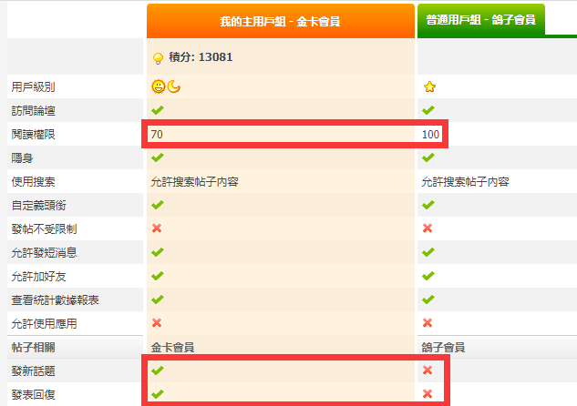

# 鸽子会员什么鬼啊

作者：充气的妹妹

TID：32746

<title>1</title> <link href="../Styles/Style.css" type="text/css" rel="stylesheet">

# 1

我看看我是啥会员，个人中心里不知道怎么看 <title>2</title> <link href="../Styles/Style.css" type="text/css" rel="stylesheet">

# 2

雀食今天看好多鸽子会员，而且权限很迷，不知道怎么定义的…… <ignore_js_op>

**QQ截图20220226233816.png** *(31.25 KB, 下載次數: 0)*

[下載附件](forum.php?mod=attachment&aid=OTQwODR8OTI1M2M0NTJ8MTY3NDA2NTYwM3wxODIzMHwzMjc0Ng%3D%3D&nothumb=yes)

2022-2-26 23:40 上傳

<title>3</title> <link href="../Styles/Style.css" type="text/css" rel="stylesheet">

# 3

参加元宵杯然后文章没写完的 统一成为鸽子会员……活动奖励？ <title>4</title> <link href="../Styles/Style.css" type="text/css" rel="stylesheet">

# 4

元宵节文章没写完吧，笑死，原来是这样的奖励 <title>5</title> <link href="../Styles/Style.css" type="text/css" rel="stylesheet">

# 5

咕咕咕来试试能不能发表咕咕咕回复～ <title>6</title> <link href="../Styles/Style.css" type="text/css" rel="stylesheet">

# 6

哈哈哈哈哈哈哈哈，元宵节文章没写完吧 <title>7</title> <link href="../Styles/Style.css" type="text/css" rel="stylesheet">

# 7

这个鸽子还挺不错 起码会动哈哈哈 <title>8</title> <link href="../Styles/Style.css" type="text/css" rel="stylesheet">

# 8

笑死了，绑定成功，现在你可以当个????了 <title>9</title> <link href="../Styles/Style.css" type="text/css" rel="stylesheet">

# 9

这个鸽子好嗨哦，好喜感，还是动图，太好玩了                        <title>10</title> <link href="../Styles/Style.css" type="text/css" rel="stylesheet">

# 10

动态图太赞了呀，咕咕会员（笑） <title>11</title> <link href="../Styles/Style.css" type="text/css" rel="stylesheet">

# 11

有一说一，有点可爱哦。动态的鸽子两只。 <title>12</title> <link href="../Styles/Style.css" type="text/css" rel="stylesheet">

# 12

作为元宵杯鸽了的奖励（确信） <title>13</title> <link href="../Styles/Style.css" type="text/css" rel="stylesheet">

# 13

鸽子会员……这个活整得????不过话说起来元宵杯鸽子真的多到有个新的用户组的程度了吗，完全没感觉 <title>14</title> <link href="../Styles/Style.css" type="text/css" rel="stylesheet">

# 14

不过确实是个好活，咕咕会员……(ಡωಡ)看到第一眼就忍不住笑了（不过话说为什么手机打字法输的表情会变成4个问号……） <title>15</title> <link href="../Styles/Style.css" type="text/css" rel="stylesheet">

# 15

仅以此来记念各位咕咕咕的鸽子（）这种艺术对于论坛来说还为时尚早 <title>16</title> <link href="../Styles/Style.css" type="text/css" rel="stylesheet">

# 16

鸽子会员是惩罚，可不是什么奖励喔！
这是对约好了要参赛，却没有完结甚至交稿的人，给予刻骨铭心的惩罚！！

请下次别再鸽了啦！文赛主办人会很难过的！ <title>17</title> <link href="../Styles/Style.css" type="text/css" rel="stylesheet">

# 17

这活整挺好，真有意思，把我给整乐了 <title>18</title> <link href="../Styles/Style.css" type="text/css" rel="stylesheet">

# 18

> [phone2345 發表於 2022-3-1 23:16](https://giantessnight.cf/gnforum2012/forum.php?mod=redirect&goto=findpost&pid=496274&ptid=32746)
> 鸽子会员是惩罚，可不是什么奖励喔！
> 这是对约好了要参赛，却没有完结甚至交稿的人，给予刻骨铭心的惩罚！ ...

但主办方自己也成了鸽子就很…… </ignore_js_op>