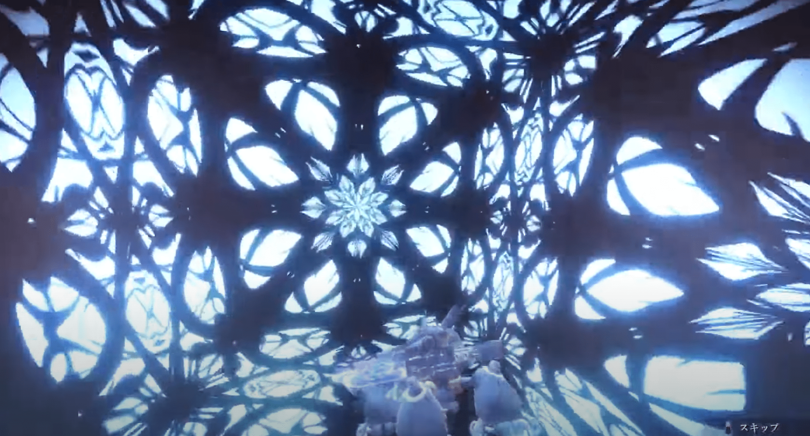

# 黎之轨迹2 黄金鲽S技

作者：aaabcd3

TID：34404

<title>1</title> <link href="../Styles/Style.css" type="text/css" rel="stylesheet">

# 1

视频的话从2分30秒开始看就好：[https://www.youtube.com/watch?v=oCFSkc41f8Y](https://www.youtube.com/watch?v=oCFSkc41f8Y)

技能的话就是用她的武器制造了一个空间把敌人关起来，最后抛到空中打爆，最后握到手里那张图还挺有GTS的感觉的
<ignore_js_op>

**1.png** *(3.84 MB, 下載次數: 0)*

[下載附件](forum.php?mod=attachment&aid=MTAwNDMxfDY5NzlmYzMxfDE2NzQwNjUyNzd8MTgyMzB8MzQ0MDQ%3D&nothumb=yes)

2022-11-14 21:46 上傳

可以脑补成2米多高的机甲兵被她缩小到手指纹路的大小

<ignore_js_op>

**2.png** *(1.54 MB, 下載次數: 0)*

[下載附件](forum.php?mod=attachment&aid=MTAwNDMyfGU3ZWU4MDE0fDE2NzQwNjUyNzd8MTgyMzB8MzQ0MDQ%3D&nothumb=yes)

2022-11-14 21:47 上傳

不过这年头还有人玩轨迹么（溜了溜了）
<title>2</title> <link href="../Styles/Style.css" type="text/css" rel="stylesheet">

# 2

哇！是轨迹！黎轨2一直没时间去玩，现在看来有动力去整了！ <title>3</title> <link href="../Styles/Style.css" type="text/css" rel="stylesheet">

# 3

> [gtshaha 發表於 2022-11-14 22:53](https://giantessnight.cf/gnforum2012/forum.php?mod=redirect&goto=findpost&pid=519645&ptid=34404)
> 哇！是轨迹！黎轨2一直没时间去玩，现在看来有动力去整了！

冲冲冲（多调调视角还是有GTS内味的） <title>4</title> <link href="../Styles/Style.css" type="text/css" rel="stylesheet">

# 4

233，我第一次看到的时候也是同样的想法，但也是因为这年头还有多少人玩轨迹就没发出来 <title>5</title> <link href="../Styles/Style.css" type="text/css" rel="stylesheet">

# 5

她的本领有个用法像是幽游白书的桑原用出次元刀，划开一个让人潜入密室的空间裂缝 <title>6</title> <link href="../Styles/Style.css" type="text/css" rel="stylesheet">

# 6

> [aaabcd3 發表於 2022-11-15 20:59](https://giantessnight.cf/gnforum2012/forum.php?mod=redirect&goto=findpost&pid=519709&ptid=34404)
> 233，我第一次看到的时候也是同样的想法，但也是因为这年头还有多少人玩轨迹就没发出来 ...

然后我看论坛也没人发，我就过来发了哈哈哈哈哈
看来还真有不少玩轨迹的，泪目
<title>7</title> <link href="../Styles/Style.css" type="text/css" rel="stylesheet">

# 7

> [Euphoria 發表於 2022-11-16 09:50](https://giantessnight.cf/gnforum2012/forum.php?mod=redirect&goto=findpost&pid=519755&ptid=34404)
> 她的本领有个用法像是幽游白书的桑原用出次元刀，划开一个让人潜入密室的空间裂缝 ...

那个武器是盟主给她的，她才有了这个本事（可能她自己本来也有这方面的能力？）
<title>8</title> <link href="../Styles/Style.css" type="text/css" rel="stylesheet">

# 8

霍，这个倍率，很喜欢。感谢楼主分享了。这就去看看 <title>9</title> <link href="../Styles/Style.css" type="text/css" rel="stylesheet">

# 9

> [Vanmilos 發表於 2022-11-16 21:02](https://giantessnight.cf/gnforum2012/forum.php?mod=redirect&goto=findpost&pid=519794&ptid=34404)
> 那个武器是盟主给她的，她才有了这个本事（可能她自己本来也有这方面的能力？）
> ...

然后师姐后来也会了               
<title>10</title> <link href="../Styles/Style.css" type="text/css" rel="stylesheet">

# 10

> [aaabcd3 發表於 2022-11-17 20:59](https://giantessnight.cf/gnforum2012/forum.php?mod=redirect&goto=findpost&pid=519849&ptid=34404)
> 然后师姐后来也会了

师姐已经无敌了（怕是以后要跟校长七姐五五开的人，给的设定都太夸张了）
<title>11</title> <link href="../Styles/Style.css" type="text/css" rel="stylesheet">

# 11

> [Vanmilos 發表於 2022-11-18 20:52](https://giantessnight.cf/gnforum2012/forum.php?mod=redirect&goto=findpost&pid=519921&ptid=34404)
> 师姐已经无敌了（怕是以后要跟校长七姐五五开的人，给的设定都太夸张了）
> ...

黄金蝶这招其实可以在gts上靠（能改变自身大小什么的</ignore_js_op></ignore_js_op>