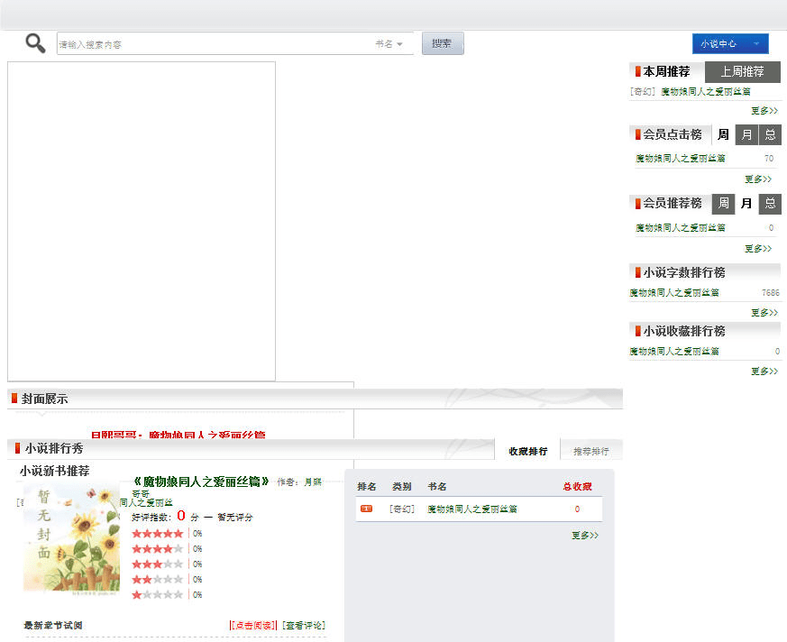

# 鼓捣了一个GTS小说系统，希望作者们能够将自己的作品哦

作者：nietao06027

TID：17800

<title>1</title> <link href="../Styles/Style.css" type="text/css" rel="stylesheet">

# 1

*本帖最後由 nietao06027 於 2014-9-21 19:00 編輯*

好吧，我是GTSLOVER的站长，求但大别
论坛前期一直都是以分享漫画为主，文章这一块因为自己以前确实接触不多，也不像但大有核心凝聚力。但是如何做的想法还是有的，那就做一个平台提供给大家，通过几天的调试，终于把文章频道上线了。基本就是模仿起点的做法了，好像除了没有月票功能、分类信息还不够完善

我简单介绍一下这个平台相对于论坛而言，较为方便地方。
1、这个平台非任何第三方平台，所以没有什么屏蔽词汇
2、这个平台与discuz的本身账号是挂钩
3、对于长篇带章节的文章而言不用在更新后在修改标题提示几楼更新，在浏览上面的体验会比论坛看完一章后在往下翻几页去寻找要好很多
4、有专门的书评区进行评论，基本功能和论坛一直，方便作者与读者之间的互动
5、和论坛积分挂钩，读者可以做作者进行打赏，增加互动
6、自带文档下载功能，方便保存手机等设备离线
6、各种排行榜，满足自己的虚荣心。

所以自己还是希望各位作者们能赏个脸，允许本人转载或者亲自更新到该系统上，也方便更多的爱好者们能够读到

PS：愿意亲自更新的作者是有专门的认证用户组~在论坛会有其他很多的福利

<ignore_js_op>

**novel.jpg** *(66.63 KB, 下載次數: 0)*

[下載附件](forum.php?mod=attachment&aid=NDY4MTV8Y2NjMjE4N2V8MTY3NDA2ODM1N3wxODIzMHwxNzgwMA%3D%3D&nothumb=yes)

2014-9-21 18:56 上傳

<ignore_js_op>

**novel2.jpg** *(109.94 KB, 下載次數: 0)*

[下載附件](forum.php?mod=attachment&aid=NDY4MTZ8N2MwOWUwYmV8MTY3NDA2ODM1N3wxODIzMHwxNzgwMA%3D%3D&nothumb=yes)

2014-9-21 18:56 上傳

<ignore_js_op>

**novel3.jpg** *(96.03 KB, 下載次數: 0)*

[下載附件](forum.php?mod=attachment&aid=NDY4MTd8MDQyYmFhZWN8MTY3NDA2ODM1N3wxODIzMHwxNzgwMA%3D%3D&nothumb=yes)

2014-9-21 18:56 上傳

<title>2</title> <link href="../Styles/Style.css" type="text/css" rel="stylesheet">

# 2

原来你就是站长，如果涉及到争议资源的话，该怎么处理呢？

比如涉及到GN原创作者的利益，该跟谁沟通？ <title>3</title> <link href="../Styles/Style.css" type="text/css" rel="stylesheet">

# 3

想問一下第二點
和discuz帳號掛勾
是GN的帳號還是GTSLOVER？ <title>4</title> <link href="../Styles/Style.css" type="text/css" rel="stylesheet">

# 4

> [xnr 發表於 2014-9-21 20:53](https://giantessnight.cf/gnforum2012/forum.php?mod=redirect&goto=findpost&pid=235129&ptid=17800)
> 原来你就是站长，如果涉及到争议资源的话，该怎么处理呢？
> 
> 比如涉及到GN原创作者的利益，该跟谁沟通？ ...

如果是他人转载侵犯作者的利益的话，可以请作者和当事人进行沟通，如果沟通无果，可以找我~

不过国内的作者尽可能不会去发布的，更多的是转向合作
<title>5</title> <link href="../Styles/Style.css" type="text/css" rel="stylesheet">

# 5

> [joe820502 發表於 2014-9-21 22:04](https://giantessnight.cf/gnforum2012/forum.php?mod=redirect&goto=findpost&pid=235136&ptid=17800)
> 想問一下第二點
> 和discuz帳號掛勾
> 是GN的帳號還是GTSLOVER？

是和GTSlover的挂钩，不过需要用到账号的就是下载小说、小说评论、小说打赏几个功能。基本阅读是没有任何限制的 <title>6</title> <link href="../Styles/Style.css" type="text/css" rel="stylesheet">

# 6

話說是不是應該貼個網址之類的
有些比較少上線的網友可能完全不知道你在講什麼

還有如果要用轉載的方式的話
還是要跟作者是先講一下並且取得同意啊
因為據我所知GTSLOVER有些漫畫
就是沒有通知作者而直接從GN這邊轉載過去的 <title>7</title> <link href="../Styles/Style.css" type="text/css" rel="stylesheet">

# 7

是啊  贴个网址或者链接多好的 <title>8</title> <link href="../Styles/Style.css" type="text/css" rel="stylesheet">

# 8

起码我自己的任何漫画都没有从GN这里过去的，没看到我连漫画狂勋章都没得么......

平台链接的话[http://bbs.gtslover.com/pdnovel.php](http://bbs.gtslover.com/pdnovel.php) <title>9</title> <link href="../Styles/Style.css" type="text/css" rel="stylesheet">

# 9

楼主如果在天朝法律管理范围内搞这个是不是有点危险啊

  有的论坛被菊爆了，然后站长被查水表，几个大写手也被查水表了

  楼主在天朝架设这个个人安全真的大丈夫噶？ <title>10</title> <link href="../Styles/Style.css" type="text/css" rel="stylesheet">

# 10

*本帖最後由 xg21066840 於 2014-9-22 13:09 編輯*

砰砰砰...
楼主开门..
顺风快递..
什么？没买东西？
查水表总行了吧..
快开门..

唔..
服务器好像在香港...

<title>11</title> <link href="../Styles/Style.css" type="text/css" rel="stylesheet">

# 11

这是一国两制的好处...不过弄归弄，还是得低调点 <title>12</title> <link href="../Styles/Style.css" type="text/css" rel="stylesheet">

# 12

看起来不错的样子。 <title>13</title> <link href="../Styles/Style.css" type="text/css" rel="stylesheet">

# 13

楼主，你哪个网站的金币量实在是金贵啊。花钱的地方不少，挣钱的方式却少的可怜。 <title>14</title> <link href="../Styles/Style.css" type="text/css" rel="stylesheet">

# 14

*本帖最後由 nietao06027 於 2014-9-23 09:33 編輯*

自己仔细看看论坛的积分获取，或许可以解答不少问题，如果积极参与的话，我觉得一天起码50金币肯定没压力吧
每日在线礼包 10金币
签到 1-6金币
发布主题和回复 分别是3个金币10次，1个金币30次
评分他人主题 1次1金币
还不包括比较好的主题，版块适当的奖励

这个我的原则是供求平衡吧，否则积累太多的金币只作为一个数据摆在那里也没什么用不是
<title>15</title> <link href="../Styles/Style.css" type="text/css" rel="stylesheet">

# 15

請問金幣是怎麼回事?不是GN論壇吧? <title>16</title> <link href="../Styles/Style.css" type="text/css" rel="stylesheet">

# 16

金币就和GN的DUCAT的性质差不多，都是论坛的积分一种，都是通过论坛的日常可以获得的</ignore_js_op></ignore_js_op></ignore_js_op>