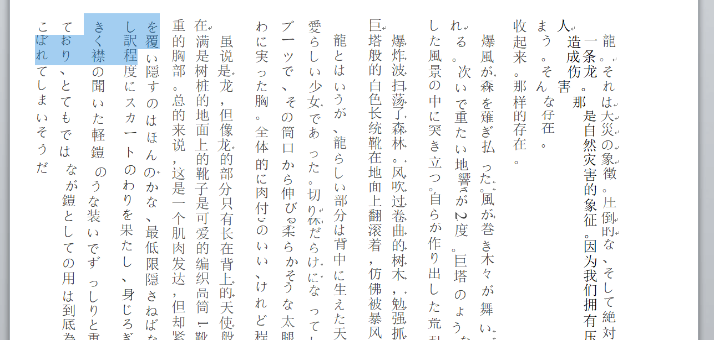

# 个人求助向，有关word之类的

作者：1569964774

TID：28202

<title>1</title> <link href="../Styles/Style.css" type="text/css" rel="stylesheet">

# 1

本人最近打算搞一个机翻加润色（脑补）烤一下白龙少女的生肉的，但最近机翻的时候遇见了一些问题
由于源文档是图片形式，将它转为docx之后出了点问题
原来是竖版排版的文章在转换后导致文档变成了横版排序的竖版文字（如下图），导致我无法提取出其中的中文从而进行翻译
问问有没有大佬懂一些这些方面的知识
我把文档直接放上来了

<title>2</title> <link href="../Styles/Style.css" type="text/css" rel="stylesheet">

# 2

 <ignore_js_op>[QQ截图20200305111852.png](forum.php?mod=attachment&aid=ODE3NjB8NTY4ZTFiMTd8MTY3NDI3Nzk4NXwxODIzMHwyODIwMg%3D%3D&nothumb=yes) *(174.74 KB, 下載次數: 0)*

[下載附件](forum.php?mod=attachment&aid=ODE3NjB8NTY4ZTFiMTd8MTY3NDI3Nzk4NXwxODIzMHwyODIwMg%3D%3D&nothumb=yes)

2020-3-5 11:22 上傳  

</ignore_js_op> <ignore_js_op>

[白龙少女4_【彩云小译】_202002282031201.docx](forum.php?mod=attachment&aid=ODE3NjF8MjA1ZGQ2NTd8MTY3NDI3Nzk4NXwxODIzMHwyODIwMg%3D%3D)

2020-3-5 11:23 上傳

點擊文件名下載附件

7.46 MB, 閱讀權限: **10**, 下載次數: 10</ignore_js_op> <title>3</title> <link href="../Styles/Style.css" type="text/css" rel="stylesheet">

# 3

你先在 word 里转换成横排再传到彩云翻译，不然你竖排它也整成竖排 <title>4</title> <link href="../Styles/Style.css" type="text/css" rel="stylesheet">

# 4

> [foxfarmer 發表於 2020-3-6 23:21](https://giantessnight.cf/gnforum2012/forum.php?mod=redirect&goto=findpost&pid=428968&ptid=28202)
> 你先在 word 里转换成横排再传到彩云翻译，不然你竖排它也整成竖排

但是这个的原版是图片模式呀

<title>5</title> <link href="../Styles/Style.css" type="text/css" rel="stylesheet">

# 5

> [1569964774 發表於 2020-3-7 12:47](https://giantessnight.cf/gnforum2012/forum.php?mod=redirect&goto=findpost&pid=429033&ptid=28202)
> 但是这个的原版是图片模式呀

原版既然能传到彩云进行翻译，应该是可编辑的 pdf 吧，试试直接把原版导出成横排的 word，再传到彩云看看
<title>6</title> <link href="../Styles/Style.css" type="text/css" rel="stylesheet">

# 6

> [foxfarmer 發表於 2020-3-7 16:15](https://giantessnight.cf/gnforum2012/forum.php?mod=redirect&goto=findpost&pid=429062&ptid=28202)
> 原版既然能传到彩云进行翻译，应该是可编辑的 pdf 吧，试试直接把原版导出成横排的 word，再传到彩云看看 ...

原图片不是pdf格式，是jpg格式

<title>7</title> <link href="../Styles/Style.css" type="text/css" rel="stylesheet">

# 7

> [1569964774 發表於 2020-3-8 19:03](https://giantessnight.cf/gnforum2012/forum.php?mod=redirect&goto=findpost&pid=429208&ptid=28202)
> 原图片不是pdf格式，是jpg格式

那直接上 ocr ，有道能较好识别竖排日文

<title>8</title> <link href="../Styles/Style.css" type="text/css" rel="stylesheet">

# 8

[https://translateimages.site/](https://translateimages.site/)

该网站可用于排版和翻译图像中的垂直文本
