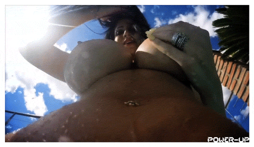
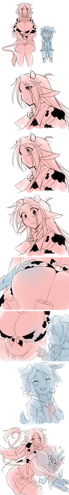

# 尋求一些情報跟推薦

作者：葬儀社

TID：23182

<title>1</title> <link href="../Styles/Style.css" type="text/css" rel="stylesheet">

# 1

*本帖最後由 葬儀社 於 2017-6-1 22:51 編輯*

恩~其實蠻多問題都是以前就有.只是沒啥急迫性又懶的問就放著
這次一次問個清楚好了.希望板上大佬幫忙

1.板上翻譯神文.1mm生存指南的後續(以解決)
就是DKW大佬翻譯的這篇
http://giantessnight.com/gnforum2012/forum.php?mod=viewthread&tid=13962&extra=page%3D11&page=1
情節非常合我胃口(溫柔系.又有些微無意識殘酷.千倍以上的差距).可是後續已經很久沒更新了.加上我本人英文苦手.
接觸到的歐美系文章都是看版上大佬翻譯才知道.所以想請問一下這篇原作是不是有接下去寫?以及後面劇情如何?

2.推薦的溫柔系文章(情色)...持續徵求中
延續上個問題.因為我本人讀過的文章量其實非常少.理由是我很挑食.外加主要都是看日系為主.感覺好像在不知不覺中漏掉許多歐美系的神作
所以想請問一下各位大佬有沒有推薦的溫柔系文.大小最好在千倍-萬倍(百倍也OK).內容情色或日常為佳.奶子描寫更棒.同人作更是歡迎

或者像是日方ドエム老師.這種雖然殘酷但情色很多.且殘酷血量...恩~就是看起不會那的痛(不知道該怎麼形容).也可以.ドエム老師在G-FORK的勇者系列真的很讚啊
尤其是女盜賊路線.
http://g-fork.come-up.to/relay/novel/1290240768.1319959674.html

3.這算是徵求吧(個人感覺機會很渺茫.不過當順便貼好了
*半解決?

求寺田老師的 超巨大おばさん上陸 實體本
當初團購考慮太久沒追到.結果一看內容完全淪陷(熟女控).只是實體本數量有限.當時有買的人應該也不多.要有多買一本的情況很渺茫.更不用說讓出來什麼的
話說寺田老師的實體本.可以用網路通路買到嗎?如果可以的話.明年去日本在想辦法寄飯店好了...不然就只能求有奇蹟出現

恩~大概就這是這樣(附上點小福利?

<title>2</title> <link href="../Styles/Style.css" type="text/css" rel="stylesheet">

# 2

 <ignore_js_op>[tumblr_o82wvvVfZA1uodfgso1_500.gif](forum.php?mod=attachment&aid=NjgxMjZ8ODMwMjQ3ZWR8MTY3NDI3Nzk5MXwxODIzMHwyMzE4Mg%3D%3D&nothumb=yes) *(1.94 MB, 下載次數: 33)*

[下載附件](forum.php?mod=attachment&aid=NjgxMjZ8ODMwMjQ3ZWR8MTY3NDI3Nzk5MXwxODIzMHwyMzE4Mg%3D%3D&nothumb=yes)

2017-5-30 17:21 上傳  

</ignore_js_op> <title>3</title> <link href="../Styles/Style.css" type="text/css" rel="stylesheet">

# 3

我尝试过续写，但是我根本就写不出那种级别的文章 <title>4</title> <link href="../Styles/Style.css" type="text/css" rel="stylesheet">

# 4

> [52gtss 發表於 2017-5-30 18:58](https://giantessnight.cf/gnforum2012/forum.php?mod=redirect&goto=findpost&pid=334124&ptid=23182)
> 我尝试过续写，但是我根本就写不出那种级别的文章

为什么，我做错了什么吗
<title>5</title> <link href="../Styles/Style.css" type="text/css" rel="stylesheet">

# 5

如果我有什么做的不对的地方，请大神指导，因为我经验太少了
<title>6</title> <link href="../Styles/Style.css" type="text/css" rel="stylesheet">

# 6

關於第一個問題，那篇文章在我心裡也是前五名的神作呢，因此當時有稍微在關心。原作者在2013年5月時還PO文說他發誓一定會將文章完結，結果半年後的下一篇回文卻說懷疑自己有辦法寫完這篇文章，並且表示已經開了新坑.....翻譯已經翻完原作者所寫的部分，沒有後續了，而原作者是否有另外發新文章續寫我是不清楚，畢竟我也沒在逛city，不過我猜他現在主力就是作3d吧......同感傷心啊

<title>7</title> <link href="../Styles/Style.css" type="text/css" rel="stylesheet">

# 7

GFORK如何找到自己喜欢的作者接龙的文章？水平参差不齐，我也不可能每个文都看下去吧 <title>8</title> <link href="../Styles/Style.css" type="text/css" rel="stylesheet">

# 8

一篇一篇找，工作量是相当大的，那么多没用的分支，我以前找过，翻得我都快抓狂了 <title>9</title> <link href="../Styles/Style.css" type="text/css" rel="stylesheet">

# 9

咱也比较中意这个大小区间，而且还最好是温柔系的文章
最近刚好翻过GS，推荐作者yumebon   [http://gs-uploader.jinja-modoki.com/upld-index.php?uname=yumebon](http://gs-uploader.jinja-modoki.com/upld-index.php?uname=yumebon)，偶像大师同人的几篇都......色气满满
另外  [http://notanota.sakura.ne.jp/notamoun/mana.htm](http://notanota.sakura.ne.jp/notamoun/mana.htm)  魔法少女まなちゃん系列虽然放缩比例达不到要求，但是如果是萝莉控的话...
<title>10</title> <link href="../Styles/Style.css" type="text/css" rel="stylesheet">

# 10

*本帖最後由 michael 於 2017-6-1 01:55 編輯*

楼主取向和我非常像算是。
以前好像有过GS上文章推荐的帖子，那帖子里回复了很多[http://giantessnight.com/gnforum ... id=18715&pid=250128](http://giantessnight.com/gnforum2012/forum.php?mod=redirect&goto=findpost&ptid=18715&pid=250128)
不过你应该都看过，那帖子你也有回复233

看了下那是15年的回复。除去上面那些。还有GS上这两年的更新的话。
近两年的话P站这几篇还不错。

[https://www.pixiv.net/novel/show.php?id=6888104](https://www.pixiv.net/novel/show.php?id=6888104)
[https://www.pixiv.net/novel/show.php?id=6776544](https://www.pixiv.net/novel/show.php?id=6776544)
这个作者的这两篇文虽然不算全温柔系，但是互动写的很赞，有写出一定的残酷但又不是那种鲜血乱飞残忍弄死的。又很好的把互动和煽动写到极致然后再给予了断。
纯温柔的也有，比如[https://www.pixiv.net/novel/show.php?id=6837194](https://www.pixiv.net/novel/show.php?id=6837194) 。总之他的文我全看过，有几篇个人觉得还是蛮不错的。

[https://www.pixiv.net/novel/member.php?id=2463968](https://www.pixiv.net/novel/member.php?id=2463968)
noa他的文有舰C和FGO属性，因为我都玩所以也会看一些。不过其中很多篇文章比较快餐，看完并没有饱食感。另外他还有写掌中世界那个游戏的同人文。写了lily和noa魔王的很多互动还行。

[https://www.pixiv.net/novel/show.php?id=5443454](https://www.pixiv.net/novel/show.php?id=5443454)
掌中世界的作者空路的文。我个人只推荐lily相关的几篇。其他的一般。

其实我感觉你作为一个老资历估计看过的东西只会比我多不会比我少。估计我说过的你都看过了。
所以估计并不能让你满意
<title>11</title> <link href="../Styles/Style.css" type="text/css" rel="stylesheet">

# 11

你要的本本，我可以讓給你喔，買到現在只有一開始翻了一次，在家無法自由觀看，不如讓給有緣人。另外打個小廣告，其他團購的我都有，有需要的也可以聯絡我，打算全部出清。詳細有那些 下班回家再找機會po
<title>12</title> <link href="../Styles/Style.css" type="text/css" rel="stylesheet">

# 12

去台灣體測現在才剛回家...(跑到腳麻.不過還好有過...

>michael
沒有沒有沒有.老實說我看得作者非常少.pixiv雖然我知道有.但沒啥耐心找.唯一有加的就是這位
[https://www.pixiv.net/novel/member.php?id=3446324](https://www.pixiv.net/novel/member.php?id=3446324)
(其實就是G/S的soujiya老師)
主要是我這個人口味太侷限了.丸吞類我幾乎不碰.但扶他還OK(甚至覺得不錯).可是只要劇情開頭沒啥吸引到我就懶得讀下去了.我也說過我本人對GTS的愛其實不高.只是喜歡把配菜通通GTS化的那種程度而已
近幾年我幾乎只追過去熟悉的幾位作者而已.而且只要別的興趣一忙.我GTS這塊就會放置不管了...

推薦文章等周六日有空再來補完>_<.這兩天得把艦蒐的月任.EO處理掉(個人習慣)...

>arisa0613
耶?真的嗎?可是目前我只對超巨大おばさん上陸這本有意思而已喔@@"(超級福利本
匯款方面我是用無摺為主.其他看你如何 <title>13</title> <link href="../Styles/Style.css" type="text/css" rel="stylesheet">

# 13

*本帖最後由 葬儀社 於 2017-6-18 22:06 編輯*

本以為後續回應會很熱烈.結果發現的時候已經沉下去了

[michael](http://giantessnight.com/gnforum2012/home.php?mod=space&uid=114)
>掌中世界的作者空路的文
空路先前在G-Fork 連載的系列我比較喜歡.當初我也是G-Fork 久未更新才知道他跑去做掌中世界的
爆乳女僕lily算是他的親女兒吧.殘酷的時候比任何人都殘忍.溫柔的時候又乖得像貓咪一樣(少有原先就有配對組合的角色?).會亂入空路各個世界觀裡也是這個角色的特色?w

>noa他的文有舰C和FGO属性
可惜角色剛好都是我比較沒愛的那一塊(汗.有時候真的會想說乾脆自己打一篇同人GTS文來自娛娛人算了
但一要動筆腦袋就一片空白

FGO的題外話:狂狗果然忍不住30抽小爆死啦XDDD.不過有海倫娜媽媽可以舔也不錯啦...抽到一堆五星禮裝總覺得心裡真不舒服(差一點點就過1%的世界線).上禮拜抽到梅芙的好運沒延續下來.殘念.只能等年中福袋

酒吞還有兩個禮拜.照自己推算湊個20-30抽應該沒問題(如果活動前又有送一波石可能到40抽?).這次真的得先打活動存呼符.慢慢抽慢慢磨了(自作虐).還有聽說簡中要搞實名制.不知道到時候有沒有大佬可以幫忙啊(我是已經綁手機了).簡中等羅生門看情況課下去吧.平安組三人一天沒湊在一起.渾身不舒服.雖然前幾天討了個有以上三人的日帳衝鬼島.但玩過更想要把他們湊在簡中主帳裡阿阿阿阿(可是台灣這邊買貴300塊好討厭阿阿阿

>[https://www.pixiv.net/novel/show.php?id=6837194](https://www.pixiv.net/novel/show.php?id=6837194)
這篇不錯.有點危機(好像會偏到殘酷那裏)吊你胃口.但最後溫馨收尾這點很讚

另外JUNKMAN老師的特麗莎後續還沒生出來.都快兩個月說.
最近缺乏那種濃烈色情又充滿溫馨的刺激啊(什麼跟什麼啊?)

還有arisa0613大佬聯繫一下就消失了...難道是我私密的錯嗎?Orz
另外補上一個小情報(雖然跟gts無關).神毛物由宇老師的マヨヒガのお姉さん要動畫化了.個人很喜歡老師的畫風以及おねショタ題材.看簡圖還原度也不錯(當然動起來又是一回事啦)
[https://www.melonbooks.co.jp/detail/detail.php?product_id=222641](https://www.melonbooks.co.jp/detail/detail.php?product_id=222641)
<ignore_js_op>

**216001012448b.jpg** *(82.11 KB, 下載次數: 0)*

[下載附件](forum.php?mod=attachment&aid=NjgzNjh8MDBhOTEyY2N8MTY3NDI3Nzk5N3wxODIzMHwyMzE4Mg%3D%3D&nothumb=yes)

2017-6-18 11:58 上傳

(挑張角度比較有點感覺得當預覽圖)

*不負責任的垃圾話時間:如果我還在打那篇斷坑文的話.應該早就把這兩位加入到桃源鄉裡.搞個巨大女僕雙重play之類的超多p大雜交吧(把正太替換成一大群小人).埋在巨大少女豐滿的肉體裡.盡情的被榨取.蹂虐.疼愛.感覺好棒啊...

還是希望板上各位大佬可以推薦些不錯的歐美大作(雖然我很挑食就是).近期比較有感覺得好像就無邊落木大佬翻譯的Cleaning up吧?
其他總覺得好像都騷不到癢處...

<title>14</title> <link href="../Styles/Style.css" type="text/css" rel="stylesheet">

# 14

 <ignore_js_op>[1479576958647.jpg](forum.php?mod=attachment&aid=NjgzNjd8MDI0YzVjYTB8MTY3NDI3Nzk5N3wxODIzMHwyMzE4Mg%3D%3D&nothumb=yes) *(1.54 MB, 下載次數: 0)*

[下載附件](forum.php?mod=attachment&aid=NjgzNjd8MDI0YzVjYTB8MTY3NDI3Nzk5N3wxODIzMHwyMzE4Mg%3D%3D&nothumb=yes)

2017-6-18 11:54 上傳  

</ignore_js_op></ignore_js_op>