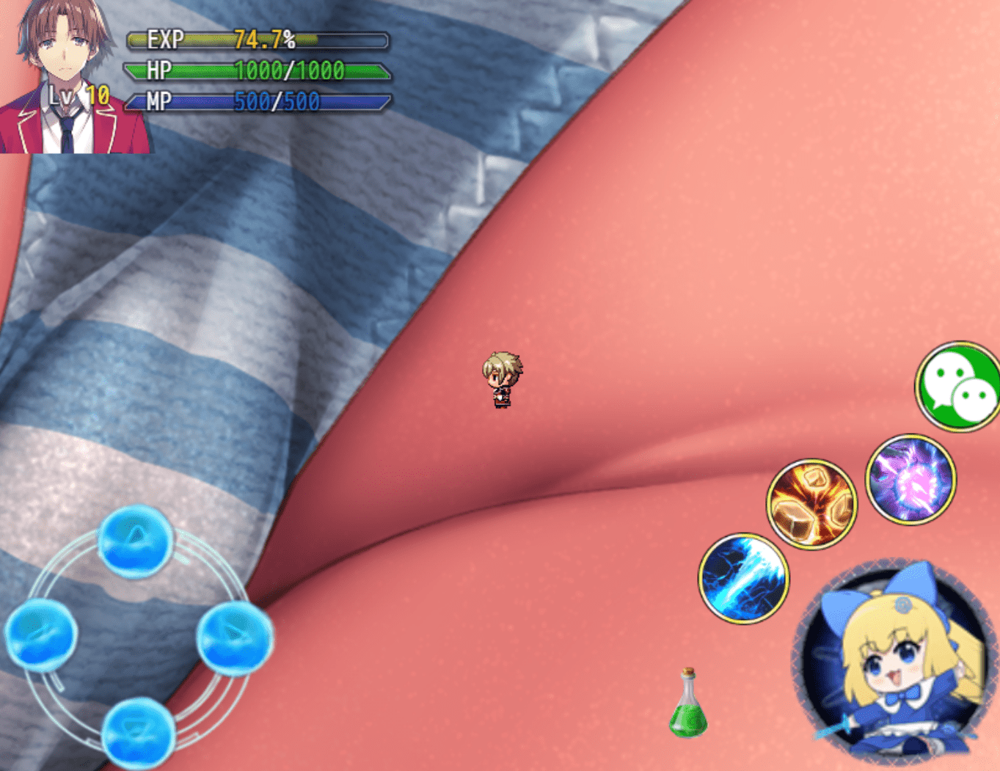

# 想做游戲，但不會畫畫，求大神給點意見

作者：(别）看我的

TID：30983

<title>1</title> <link href="../Styles/Style.css" type="text/css" rel="stylesheet">

# 1

最近心血來潮想（學習）做游戲 應該是用RPGVX MZ
但是本人美術零分 畫出來跟火柴人沒什麽分別
想試試看學3DRender的道路

最近爬了一會兒文 感覺版上大佬大多是MMD或者Blender

感覺MMD挺好看 畫風比較可愛 不過限制好像有點多 效果要靠MME做出來 模型要靠PDME修 真的不太有信心

想試試Blender 但是模型好像比較沒那麽可愛 而且也怕會不會對新手來説太難

我自己有Maya底子 但是還沒有能自己捏臉的程度
我本科也不是電腦 只是靠空閑時間偶爾學學

求大佬給點意見
MMD會相對比較簡單嗎？MME能模仿噴奶，口水之類的效果嗎？
Blender有可愛的模型資源嗎？
Maya還行不？（好端端Maya被Autotdesk搞死真可惜）...
<title>2</title> <link href="../Styles/Style.css" type="text/css" rel="stylesheet">

# 2

刚入门的话尽量别碰3D制作，容易花费大量时间在3D软件的学习上，丧失热情。我建议走2D的路线，图片不用自己画，找画师画好的，比如寺田落子等。你要做的工作，就是想个剧情，配上文字，把你收集到的CG图片串起来！！ <title>3</title> <link href="../Styles/Style.css" type="text/css" rel="stylesheet">

# 3

游戏的内容，建议走缩小系。游戏脚本不要自己写，依然是找别人写好的，你看着好用就用。开发游戏时间长，热情容易丧失。像图片，音乐，游戏插件等等，能不自己做就不自己做。最重要的是剧情，是文字，把这些东西连接起来形成游戏。 <title>4</title> <link href="../Styles/Style.css" type="text/css" rel="stylesheet">

# 4

图片不一定非要圈内的，你可以找pixiv的。缩小系游戏中，偷窥图，俯视图等裙底图在其他圈子里有大把画师在画。如果反感用圈内大佬的图，就用圈外大佬画好的图片，偶尔有空ps一些小人上去也好。总之，图片素材最好不要自己生产，耗时太长了，编写游戏剧情才是游戏创作者做的事情(^^)/ <title>5</title> <link href="../Styles/Style.css" type="text/css" rel="stylesheet">

# 5

对了，RPG MZ引擎太新了，做好的脚本插件比较少。如果想直接用别人做好的脚本插件，建议走RPG MV引擎。 <title>6</title> <link href="../Styles/Style.css" type="text/css" rel="stylesheet">

# 6

用RPG MV的话，可以看看水菌菌，血蔷薇他们做好游戏，是开源的。里面的一些地图放缩，人物缩小，光影等插件调用方法都有，学起来也比较快。用RPG VX的话可以看看神降马克，孤鸿，缩小学院外传的，也是开源的，里面的脚本也有好多。 <title>7</title> <link href="../Styles/Style.css" type="text/css" rel="stylesheet">

# 7

做游戏的话建议走身体探索图哟，小小的主角在妹纸身上奔跑的样子感觉很奈斯！
<title>8</title> <link href="../Styles/Style.css" type="text/css" rel="stylesheet">

# 8

 <ignore_js_op>[63a1850c36c8a973.png](forum.php?mod=attachment&aid=ODkwMDZ8NGQ4N2I0NjV8MTY3NDI3Nzk4MHwxODIzMHwzMDk4Mw%3D%3D&nothumb=yes) *(1.37 MB, 下載次數: 0)*

[下載附件](forum.php?mod=attachment&aid=ODkwMDZ8NGQ4N2I0NjV8MTY3NDI3Nzk4MHwxODIzMHwzMDk4Mw%3D%3D&nothumb=yes)

2021-5-30 14:35 上傳  

</ignore_js_op> <title>9</title> <link href="../Styles/Style.css" type="text/css" rel="stylesheet">

# 9

> [AK45 發表於 2021-5-30 14:25](https://giantessnight.cf/gnforum2012/forum.php?mod=redirect&goto=findpost&pid=469873&ptid=30983)
> 对了，RPG MZ引擎太新了，做好的脚本插件比较少。如果想直接用别人做好的脚本插件，建议走RPG MV引擎。 ...

想學Javascript寫寫Plugin 所以是MV會比較好嗎？我是看到MZ的内建ATB挺吸引的才想試試MZ
<title>10</title> <link href="../Styles/Style.css" type="text/css" rel="stylesheet">

# 10

引擎本身肯定是MZ比MV好的，是MV的升级版。只是MZ是新出的，一些游戏脚本没有人写，圈内游戏也很少有MZ做，大多数是MV。MV就是现有的插件和成品游戏多，资料丰富。你可以权衡一下，喜欢原创的话用MZ，喜欢借鉴其他人写好的脚本或者游戏的话用MV(^^)/ <title>11</title> <link href="../Styles/Style.css" type="text/css" rel="stylesheet">

# 11

还有一点最重要的是MV可以做成手机游戏，打包成app的软件也比较多。MZ的打包软件比较少。 <title>12</title> <link href="../Styles/Style.css" type="text/css" rel="stylesheet">

# 12

> [AK45 發表於 2021-5-30 15:22](https://giantessnight.cf/gnforum2012/forum.php?mod=redirect&goto=findpost&pid=469878&ptid=30983)
> 引擎本身肯定是MZ比MV好的，是MV的升级版。只是MZ是新出的，一些游戏脚本没有人写，圈内游戏也很少有MZ做， ...

剛剛試了一下 發現MZ和MV的脚本好像能互通 都是Js 很棒

<title>13</title> <link href="../Styles/Style.css" type="text/css" rel="stylesheet">

# 13

Blender可以用日系畫風，甚至也可以用mmd風格作圖
[https://blenderartists.org/t/bb-fate/1171356](https://blenderartists.org/t/bb-fate/1171356)
但是超級困難，在Blender裡面寫實打光很簡單，非寫實(Non-Photorealistic Rendering, NPR)反而很麻煩
如果你喜歡MMD那種風格，那Blender有高許多的天花板，可以讓你做出超級厲害的圖片，
但是學習起來超級麻煩，所以除非你有色圖外的目標，MMD的投資報酬快多了，能用就好