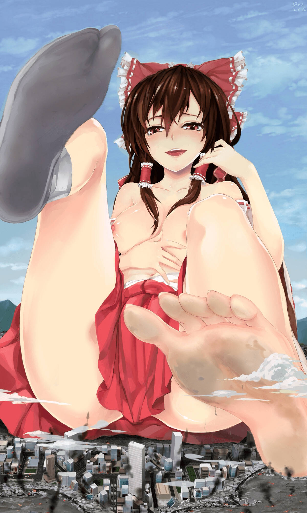

# 求图的作者

作者：jwb1989

TID：33316

<title>1</title> <link href="../Styles/Style.css" type="text/css" rel="stylesheet">

# 1

想请教下大神们，这张图的作者是谁呀？
<title>2</title> <link href="../Styles/Style.css" type="text/css" rel="stylesheet">

# 2

 <ignore_js_op>[180743.jpg](forum.php?mod=attachment&aid=OTY0NDB8NDdhMjhjMDR8MTY3NDI3Nzk3M3wxODIzMHwzMzMxNg%3D%3D&nothumb=yes) *(517.72 KB, 下載次數: 2)*

[下載附件](forum.php?mod=attachment&aid=OTY0NDB8NDdhMjhjMDR8MTY3NDI3Nzk3M3wxODIzMHwzMzMxNg%3D%3D&nothumb=yes)

2022-5-27 03:34 上傳  

</ignore_js_op> <title>3</title> <link href="../Styles/Style.css" type="text/css" rel="stylesheet">

# 3

一直想找到一张缩学雷娜的，是吃着棒冰，脚趾上有小人的，感觉和这个作者的画风差不多 <title>4</title> <link href="../Styles/Style.css" type="text/css" rel="stylesheet">

# 4

这个图可以在Danbooru上找到，搜索sonnano
<title>5</title> <link href="../Styles/Style.css" type="text/css" rel="stylesheet">

# 5

 <ignore_js_op>[__shukushou_gakuen_drawn_by_sonnano__sample-30294b0d1bb6f7fe265f94b073a0533c.jpg](forum.php?mod=attachment&aid=OTcwMjZ8MmY1ZDA2ZmN8MTY3NDI3Nzk3M3wxODIzMHwzMzMxNg%3D%3D&nothumb=yes) *(167.37 KB, 下載次數: 4)*

[下載附件](forum.php?mod=attachment&aid=OTcwMjZ8MmY1ZDA2ZmN8MTY3NDI3Nzk3M3wxODIzMHwzMzMxNg%3D%3D&nothumb=yes)

2022-6-15 22:29 上傳  

</ignore_js_op> <title>6</title> <link href="../Styles/Style.css" type="text/css" rel="stylesheet">

# 6

太谢谢了，我很早以前在giantessbooru上看到的，后来翻了300多页都没找到，太感谢了