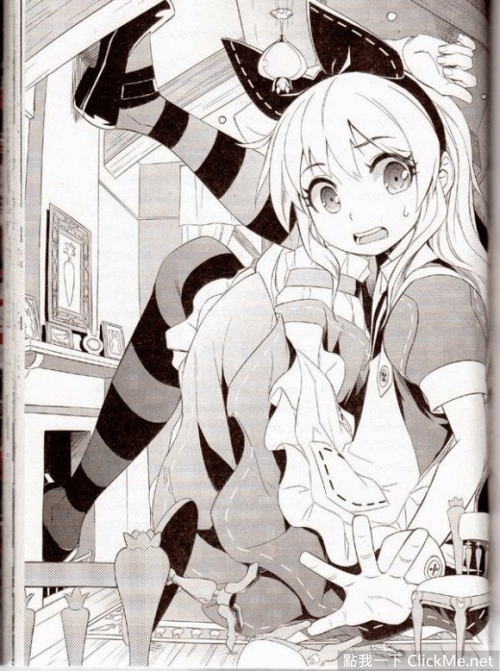

# 話說有沒有人知道這個美國新版的《愛麗絲夢遊仙境》

作者：joke0857

TID：20897

<title>1</title> <link href="../Styles/Style.css" type="text/css" rel="stylesheet">

# 1

話說有沒遊人知道這個美國新版的《愛麗絲夢遊仙境》
[http://clickme.net/31171](http://clickme.net/31171)
<ignore_js_op>

**7c201f0d90ca8e34a4ee6915fd7f54f2.jpg** *(105.92 KB, 下載次數: 3)*

[下載附件](forum.php?mod=attachment&aid=NjA2MTh8ZGE1ZTQzZDV8MTY3NDI3Nzk5OXwxODIzMHwyMDg5Nw%3D%3D&nothumb=yes)

2016-4-7 22:48 上傳

<title>2</title> <link href="../Styles/Style.css" type="text/css" rel="stylesheet">

# 2

史上最好一版爱丽丝（无责任

光速右键 <title>3</title> <link href="../Styles/Style.css" type="text/css" rel="stylesheet">

# 3

很久以前就有了，我还买了一本，画师是菲律宾的kriss sison，不过身为爱丽丝迷我最喜欢的是藤原fuzichoko画的爱丽丝同人，真的是超可爱 <title>4</title> <link href="../Styles/Style.css" type="text/css" rel="stylesheet">

# 4

亚马逊已下单，这种东西一定要收藏一本 <title>5</title> <link href="../Styles/Style.css" type="text/css" rel="stylesheet">

# 5

> [tianjinfeng 發表於 2016-4-7 23:36](https://giantessnight.cf/gnforum2012/forum.php?mod=redirect&goto=findpost&pid=289679&ptid=20897)
> 很久以前就有了，我还买了一本，画师是菲律宾的kriss sison，不过身为爱丽丝迷我最喜欢的是藤原fuzichoko画 ...

請問哪邊買的?有網址嗎?有賣電子檔嗎?
<title>6</title> <link href="../Styles/Style.css" type="text/css" rel="stylesheet">

# 6

这。。。这是。。。巨大化版本的爱丽丝！一直都想着原来真的有啊~ <title>7</title> <link href="../Styles/Style.css" type="text/css" rel="stylesheet">

# 7

这个必须要啊，好久没看见这么好的了。 <title>8</title> <link href="../Styles/Style.css" type="text/css" rel="stylesheet">

# 8

> [joke0857 發表於 2016-4-8 14:31](https://giantessnight.cf/gnforum2012/forum.php?mod=redirect&goto=findpost&pid=289702&ptid=20897)
> 請問哪邊買的?有網址嗎?有賣電子檔嗎?

京东上直接搜索Alice's Adventures in Wonderland 首页往下翻一点可以找到，澜瑞外文书店，原装实体……虽然我没试过，但是…… 
不过价格感人……

<title>9</title> <link href="../Styles/Style.css" type="text/css" rel="stylesheet">

# 9

> [joke0857 發表於 2016-4-8 14:31](https://giantessnight.cf/gnforum2012/forum.php?mod=redirect&goto=findpost&pid=289702&ptid=20897)
> 請問哪邊買的?有網址嗎?有賣電子檔嗎?

萌购上搜画师名字kriss sison就有了。。。。。当然日亚什么的也可以，反正我是通过萌购买的。。。。</ignore_js_op>