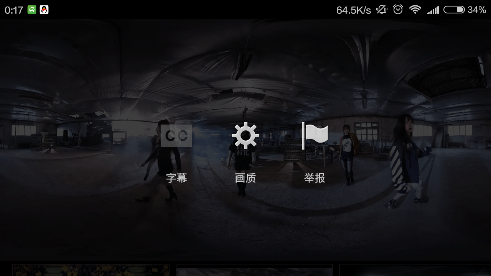
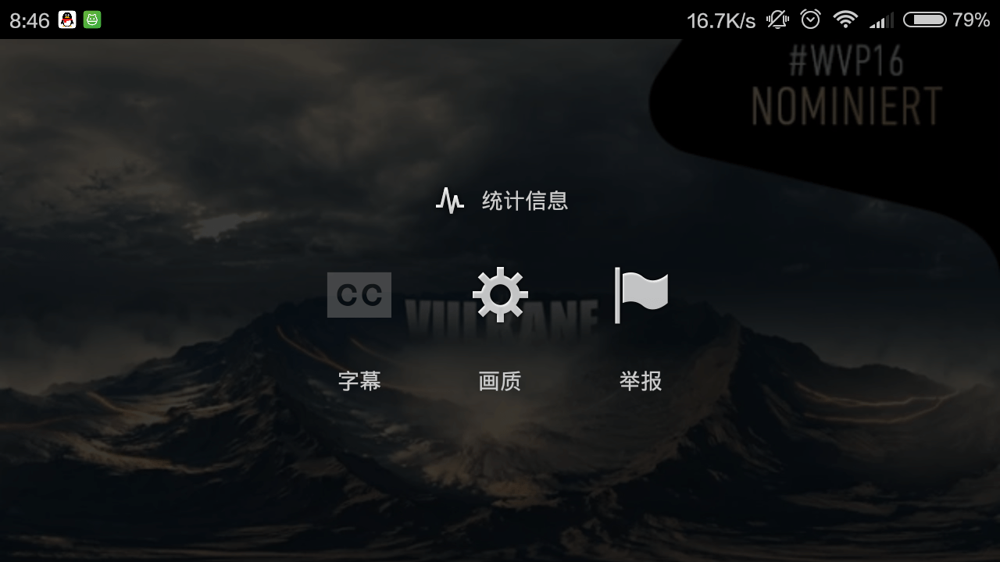

# 问一个关于YouTube上VR的问题

作者：nightdm

TID：21101

<title>1</title> <link href="../Styles/Style.css" type="text/css" rel="stylesheet">

# 1

好不容易买了cardboard眼镜，翻过了墙，root了手机，下载了google play服务，打开了YouTube，看到了vr视频。刚准备来一发，结果没有cardboard选项！视频没法分屏，没有vr效果！我的心瞬间就凉了。下载的是最新版的YouTube app，请问高手知道是怎么回事吗？ <title>2</title> <link href="../Styles/Style.css" type="text/css" rel="stylesheet">

# 2

*本帖最後由 CHUNMO3 於 2016-5-18 09:05 編輯*

右上角菜单栏是这个样子，少了cardboard选项。 <title>3</title> <link href="../Styles/Style.css" type="text/css" rel="stylesheet">

# 3

 <ignore_js_op>[Screenshot_2016-05-18-00-17-03_com.google.android.youtube.png](forum.php?mod=attachment&aid=NjEzNzF8Y2U0NDI2ZTN8MTY3NDI3Nzk5OHwxODIzMHwyMTEwMQ%3D%3D&nothumb=yes) *(616.6 KB, 下載次數: 1)*

[下載附件](forum.php?mod=attachment&aid=NjEzNzF8Y2U0NDI2ZTN8MTY3NDI3Nzk5OHwxODIzMHwyMTEwMQ%3D%3D&nothumb=yes)

2016-5-18 09:05 上傳  

</ignore_js_op> <title>4</title> <link href="../Styles/Style.css" type="text/css" rel="stylesheet">

# 4

右上角菜单栏是这个样子，少了cardboard选项。 <title>5</title> <link href="../Styles/Style.css" type="text/css" rel="stylesheet">

# 5

 <ignore_js_op>[Screenshot_2016-05-18-08-46-12_com.google.android.youtube.png](forum.php?mod=attachment&aid=NjEzNzB8YTMwMTE1ZGR8MTY3NDI3Nzk5OHwxODIzMHwyMTEwMQ%3D%3D&nothumb=yes) *(384.01 KB, 下載次數: 0)*

[下載附件](forum.php?mod=attachment&aid=NjEzNzB8YTMwMTE1ZGR8MTY3NDI3Nzk5OHwxODIzMHwyMTEwMQ%3D%3D&nothumb=yes)

2016-5-18 08:59 上傳  

</ignore_js_op> <title>6</title> <link href="../Styles/Style.css" type="text/css" rel="stylesheet">

# 6

无能为力啊，并没有那个眼镜。。。
虽然不知道能不能帮上忙，在youtube链接前面➕ss可以下载视频 <title>7</title> <link href="../Styles/Style.css" type="text/css" rel="stylesheet">

# 7

> gh1456gh 發表於 2016-5-18 10:49
> 无能为力啊，并没有那个眼镜。。。
> 虽然不知道能不能帮上忙，在youtube链接前面➕ss可以下载视频 ...

我是用的手机YouTube app，曾经调出过分屏效果来，现在不知道怎么弄了。 <title>8</title> <link href="../Styles/Style.css" type="text/css" rel="stylesheet">

# 8

建议下载下来看
还有VR眼镜很便宜
几十块就可以买到。
一两百和几十块观看效果是一样的
为什么卖一两百？
因为 带着舒服 <title>9</title> <link href="../Styles/Style.css" type="text/css" rel="stylesheet">

# 9

> jiachufan1 發表於 2016-5-18 14:20
> 建议下载下来看
> 还有VR眼镜很便宜
> 几十块就可以买到。

嗯，已入手眼镜，我之前还能用YouTube手机app在线看的，现在弄不出来了。 <title>10</title> <link href="../Styles/Style.css" type="text/css" rel="stylesheet">

# 10

我用的是暴风魔镜，那个可以把电脑端的视频飞到手机上 自动分屏，你这个，嗯 没用过 <title>11</title> <link href="../Styles/Style.css" type="text/css" rel="stylesheet">

# 11

把youtube视频下下来呀 然后用各种vrAPP看 橙子VR UTOVR 暴风魔镜 好多呢 随便看 <title>12</title> <link href="../Styles/Style.css" type="text/css" rel="stylesheet">

# 12

> 泡面 發表於 2016-5-19 10:28
> 把youtube视频下下来呀 然后用各种vrAPP看 橙子VR UTOVR 暴风魔镜 好多呢 随便看

说的也是，正准备下载。 <title>13</title> <link href="../Styles/Style.css" type="text/css" rel="stylesheet">

# 13

是啊，下载下来转到vr播放器上看最好了，但是要注意手机的分辨率，有的手机没办法观看4k视频，强行观看会有卡顿现象