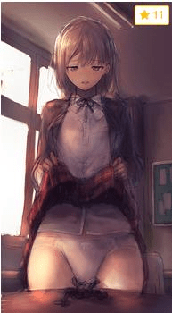
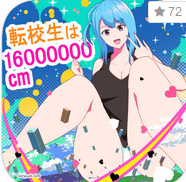

# 问个fantia的问题

作者：gfktxds

TID：29422

<title>1</title> <link href="../Styles/Style.css" type="text/css" rel="stylesheet">

# 1

有圈友能列举一下国外哪些大神是用fantia的嘛，给个网址最好，谢谢了，因为发现fantia能用支付宝支付 <title>2</title> <link href="../Styles/Style.css" type="text/css" rel="stylesheet">

# 2

我感觉日本的画师大部分都是用fantia的，只要找到他们的推特，好像都会放出连接来 <title>3</title> <link href="../Styles/Style.css" type="text/css" rel="stylesheet">

# 3

honey terrace (はちみつ)
[https://fantia.jp/posts/451154](https://fantia.jp/posts/451154)
<ignore_js_op>

**微信截图_20200905133145.jpg** *(11.29 KB, 下載次數: 0)*

[下載附件](forum.php?mod=attachment&aid=ODQ5NjN8MzBlM2JlMGJ8MTY3NDI3Nzk4MnwxODIzMHwyOTQyMg%3D%3D&nothumb=yes)

2020-9-6 01:34 上傳

まるしゃも
[https://fantia.jp/posts/446776](https://fantia.jp/posts/446776)
<ignore_js_op>

**微信截图_20200905133223.png** *(44.37 KB, 下載次數: 0)*

[下載附件](forum.php?mod=attachment&aid=ODQ5NjZ8MWE4NzllYTB8MTY3NDI3Nzk4MnwxODIzMHwyOTQyMg%3D%3D&nothumb=yes)

2020-9-6 01:34 上傳

soryuu4 (ソリュウ) <<<这人的风格我不是很喜欢，但是也关注了
[https://fantia.jp/fanclubs/2006](https://fantia.jp/fanclubs/2006)
<ignore_js_op>

**微信截图_20200905133247.png** *(83.64 KB, 下載次數: 0)*

[下載附件](forum.php?mod=attachment&aid=ODQ5NjV8YmE2YTAzMWR8MTY3NDI3Nzk4MnwxODIzMHwyOTQyMg%3D%3D&nothumb=yes)

2020-9-6 01:34 上傳

MeL (きゃらめる) <<< 3D图，我觉得做的不错
[https://fantia.jp/fanclubs/29827](https://fantia.jp/fanclubs/29827)
<ignore_js_op>

**微信截图_20200905133305.png** *(176.29 KB, 下載次數: 0)*

[下載附件](forum.php?mod=attachment&aid=ODQ5NjR8NDBjMTkwZTd8MTY3NDI3Nzk4MnwxODIzMHwyOTQyMg%3D%3D&nothumb=yes)

2020-9-6 01:34 上傳

<title>4</title> <link href="../Styles/Style.css" type="text/css" rel="stylesheet">

# 4

*本帖最後由 sidefx 於 2020-9-6 06:34 編輯*

不少作者除了Fantia同时也有开Fanbox，Patreon，或者Ci-en，可以在几个里面选一下。
当然有些为了公平会在Fanbox删除之前的内容，让所有站点都保持Fantia模式。

只有开Fanbox但是没有Fantia的也不少。

太多了，就不一一列举了，补充几个吧(像MUK这种非纯GTS就不贴了)：

冬野みかん（在这里也可以commission）
[https://fantia.jp/fanclubs/37859](https://fantia.jp/fanclubs/37859)

アルカリ
[https://fantia.jp/fanclubs/63789](https://fantia.jp/fanclubs/63789)

rakiA
[https://fantia.jp/fanclubs/6891](https://fantia.jp/fanclubs/6891)

DRE
[https://fantia.jp/fanclubs/8352](https://fantia.jp/fanclubs/8352)

寺田落子
[https://fantia.jp/fanclubs/1492](https://fantia.jp/fanclubs/1492)

蒼凪いばね
[https://fantia.jp/fanclubs/6933](https://fantia.jp/fanclubs/6933)

Lien
[https://fantia.jp/fanclubs/3486](https://fantia.jp/fanclubs/3486)

Ibara（ExRumya）
[https://fantia.jp/fanclubs/3429](https://fantia.jp/fanclubs/3429)

灯
[https://fantia.jp/fanclubs/7761](https://fantia.jp/fanclubs/7761)

AliceMagic
[https://fantia.jp/fanclubs/18160](https://fantia.jp/fanclubs/18160)

夏目なつめ
[https://fantia.jp/fanclubs/7152](https://fantia.jp/fanclubs/7152)

さやめ (沙弥匁)
[https://fantia.jp/fanclubs/7451](https://fantia.jp/fanclubs/7451)

kazo
[https://fantia.jp/fanclubs/5213](https://fantia.jp/fanclubs/5213)

スーパーキノコクラブ (アベリオン)
[https://fantia.jp/fanclubs/3146](https://fantia.jp/fanclubs/3146)

ほろにゃんくらぶ (ほろ酔いにゃんこ)
[https://fantia.jp/fanclubs/3081](https://fantia.jp/fanclubs/3081)

还有几个目前只有免费plan，订阅相当于加个关注：

えどねこカフェ (えどわーど，就是以前gs-uploader的Ed)
[https://fantia.jp/fanclubs/12177](https://fantia.jp/fanclubs/12177)

Lucy（SiroUT）
[https://fantia.jp/fanclubs/48518](https://fantia.jp/fanclubs/48518)

Miu
[https://fantia.jp/fanclubs/24698](https://fantia.jp/fanclubs/24698)

<title>5</title> <link href="../Styles/Style.css" type="text/css" rel="stylesheet">

# 5

シャルロッテ
[https://fantia.jp/fanclubs/68921](https://fantia.jp/fanclubs/68921) <title>6</title> <link href="../Styles/Style.css" type="text/css" rel="stylesheet">

# 6

哇，谢了，我看看有没有喜欢的赞助 <title>7</title> <link href="../Styles/Style.css" type="text/css" rel="stylesheet">

# 7

> gtshaha 發表於 2020-9-5 20:30
> 我感觉日本的画师大部分都是用fantia的，只要找到他们的推特，好像都会放出连接来 ...

以前不怎么翻，不太清楚有哪些个作者，所以一般来说推特都找不到 <title>8</title> <link href="../Styles/Style.css" type="text/css" rel="stylesheet">

# 8

肉まんの国 (いばらーど)</ignore_js_op></ignore_js_op></ignore_js_op></ignore_js_op>